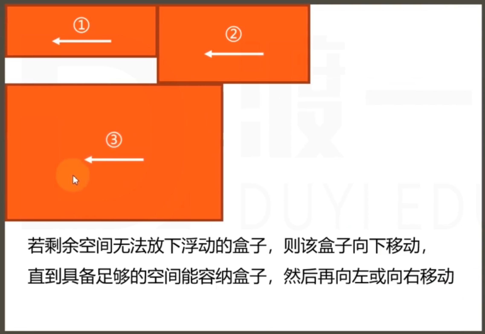
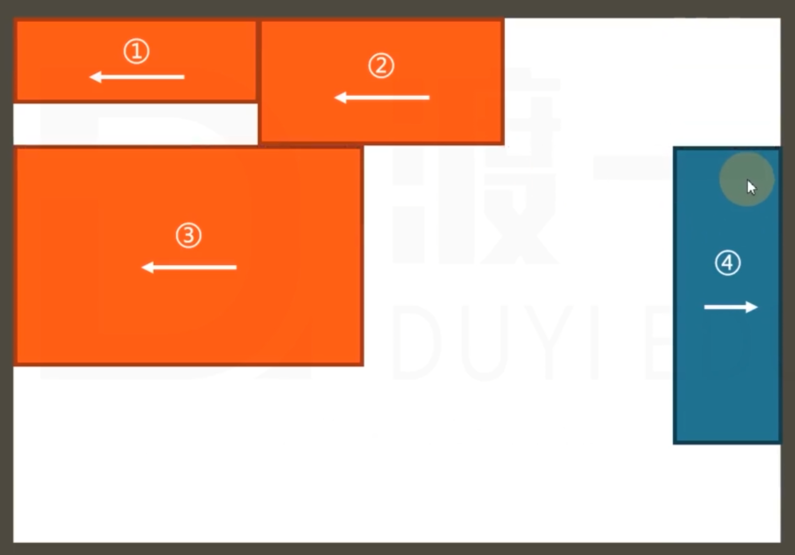

<!--
 * @Author: KESHAOYE
 * @Date: 2023-03-27 21:26:28
-->
# CSS视觉格式化模型

盒模型：规定单个盒子的规则

视觉格式化模型：页面上多个盒子的排列（布局）规则

视觉格式化模型，大体上将页面中盒子的排列分为三种方式：

1. 常规流
2. 浮动
3. 定位

## 常规(普通)流

常规流又称文档流、普通文档流、常规文档流

所有元素默认下，都属于常规流布局

总体规则：块盒独占一行，行盒水平依次排列

### 包含块（containing block）：

每个盒子都有它的**包含块**，包含块决定了盒子的排列区域。

绝大部分情况下：盒子的包含块是父元素的**内容盒**

```html
<!-- 在下面这个例子中，child的包含块是parent的内容盒（content-box） -->
<div class='parent'>
  <div class='child'></div>
</div>
```

### 块盒

<br/>

#### 1. 每个块盒的总宽度必须等于包含块的宽度

宽度的默认值是auto（吸收剩余水平空间）

margin（默认为0）的取值也可以是auto，；

当width和margin都是auto时，宽度吸收能力强于margin

若宽度、边框（border）、内边距（padding）、外边距（margin）计算后，仍有剩余空间，该剩余空间全部被margin-right吸收

在常规流中，块盒在其包含块中**居中**，可以定宽，设置左右margin值为auto

#### 2. 每个块盒垂直方向上的auto

设置height：auto（根据内容决定高度）

垂直方向设置margin:auto, 表示margin为0

#### 3. 百分比取值

padding、宽高、margin可以取值为百分比

横向百分比都相对于包含块的宽度

**高度的百分比有两种情况：**

1）若包含块的高度取决于子元素的高度，设置百分比无效

2）若包含块的高度不取决于子元素的高度，百分比相对于包含块（父元素）的高度

#### 4.上下外边距的合并

两个常规流块盒，上下外边距相邻(不止兄弟元素，父子元素也会发生合并,border也会阻隔相邻)，会进行合并（取较大值合并）。

```html
<style>
  /**预想中子元素与父元素有边距，实际为0，合并了 */
  .father{
    margin-top: 50px
  }
  .son {
    margin-top:50px
  }
</style>

<div class='father'>
  <div class='son'></div>
</div>
```

## 浮动

### 应用场景

1. 文字环绕
2. 横向排列

### 浮动的基本特点

修改float属性值为:

- left: 左浮动，元素靠上靠左
- right： 右浮动，元素靠上靠右


> 浮动的兼容性好（IE5以上）,默认值为none

1. 当一个元素浮动后，**元素必定为块盒**（更改display属性为块盒(block)）
2. 浮动元素的包含块和常规流一样（**包含块为父元素的内容盒**）

### 盒子尺寸

1. 宽度为auto时，适应内容宽度
2. 高度为auto时，与常规流一致（**高度为auto时,根据内容决定高度**）
3. margin设置为auto时，margin值为0
4. 边框、内边距百分比设置与常规流一致

### 盒子排列（位置）

1. 左浮动的盒子靠上靠左排列（左上）
2. 右浮动的盒子靠上靠右排列（右上）
3. 在包含块中排列时，会避开常规流盒子（常规流盒子在前，浮动盒子在后）
```html
<!-- floatBox会避开noraml，直接排列在noraml下面 -->
  <div class='container'>
    <div class='normal'>常规流盒子</div>
    <div class='floatBox'>浮动盒子</div>
    <div class='floatBox'>浮动盒子</div>
  </div>
```
4. 常规流盒子在排列时，无视浮动盒
```html
<!-- normal会无视floatbox，直接排列在floatbox下一层(浮动盒子在常规流盒子上面) -->
  <div class='container'>
    <div class='floatBox'>浮动盒子</div>
    <div class='floatBox'>浮动盒子</div>
    <div class='normal'>常规流盒子</div>
  </div>
```
6. 行盒在排列时，会避开浮动盒子(**排在浮动盒子后面**)
7. 外边距（margin）合并不会发生
8. 若剩余空间无法放下浮动的盒子，则该盒子向下移动，直到具备足够的空间能容纳盒子，然后再向左或向右移动

**下图中，3盒宽度过宽，所以先向下移动到第二行，在左移动**


9. 浮动盒子的顶边不能高于上一个盒子的顶边

**下图中，4盒为右浮动 不能在第一行 顶边只能与3齐平**


> 如果文字没有在行盒中，浏览器会直接生成一个行盒来包裹文字，该行盒叫做匿名行盒 

### 高度坍塌

#### 什么是高度坍塌

一般是父元素未设置高度时（由子元素撑起），子元素为浮动元素，会造成高度坍塌。


高度坍塌的根源：常规流盒子在自动计算高度时，会忽略浮动盒子

解决方法：清除浮动，涉及CSS属性：
- 默认值：none
- left：清除左浮动，该元素必须出现在前面所有左浮动盒子的下方。
- right：清除右浮动，该元素必须出现在前面所有右浮动盒子的下方。
- both：清除所有浮动，该元素必须出现在前面所有浮动盒子的下方。
```css
.parent {
  border: 10px solid red;
}
.clearfix::after {
  content: '';
  display: block;
  clear: both;

}
.son {
  float: left;
  width: 100px;
  height: 100px;
}
```

---

## 定位

手动控制元素在包含块中的精准位置

**涉及的CSS属性：position**

### position

- 默认值：static，静态定位（不定位）
- relative：相对定位
- absolute：绝对定位
- fixed：固定定位

**定位元素会脱离常规流**（相对定位-position：relative除外）

一个脱离了文档流的元素：

1. 文档流中的元素摆放时，会忽略脱离文档流的元素
2. 文档流中元素计算自动高度时，会忽略脱离文档流的元素

### 相对定位（relative）

**不会导致元素脱离文档流**，只是让元素在原来位置上发生偏移

可以通过四个CSS属性设置其位置(**上下发生矛盾以上边为主，左右发生矛盾以左边为主**)

- left
- right
- top
- bottom

盒子的偏移不会对其他盒子产生影响

### 绝对定位(absolute)

1. 宽高为auto，适应内容
2. 包含块变化：找祖先元素中第一个定位元素（position非static的元素），若找不到，则它的包含块为整个网页
3. 根据包含块定位（left、right、top、bottom）

### 固定定位(fixed)

其他情况和绝对定位一样

包含块不同：固定为视口（浏览器的可视窗口）

## 定位下的居中

某个方向居中：

1. 定宽（高）
2. 将左右（上下）距离设为0
3. 将左右（上下）margin设置为auto

```css
  .middle {
    width: 100px;
    height: 100px;
    margin: auto;
  }
```

绝对定位和固定定位中，margin设置为auto时会自动吸收剩余空间

## 多个定位元素重叠

堆叠上下文

设置z-index，通常情况下，该值越大，越靠近用户

只有定位元素设置z-index有效

z-index可以是负数，**如果是负数，则遇到常规流和浮动元素，则会覆盖**

## 补充

- 绝对定位(relative)、固定定位(fixed)元素一定是块盒
- 绝对定位、固定定位元素一定不是浮动
- 没有外边距合并