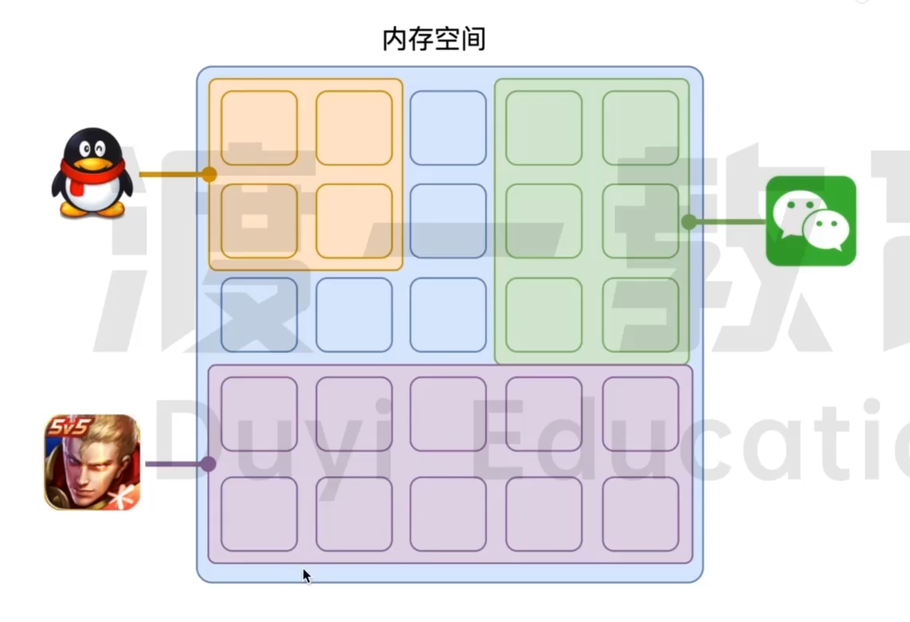
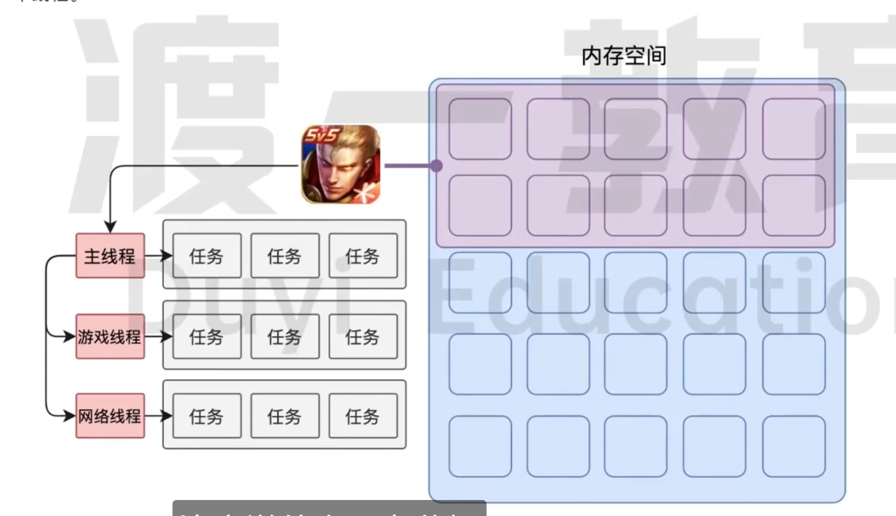
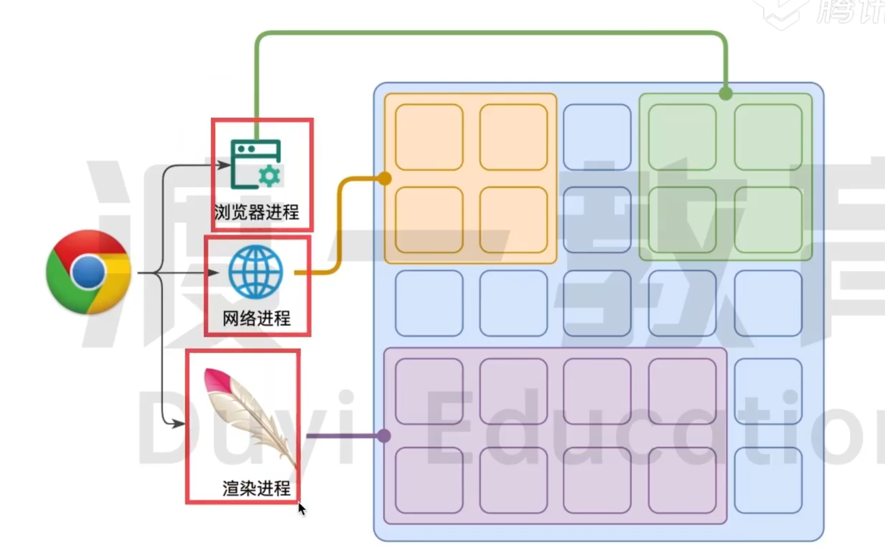
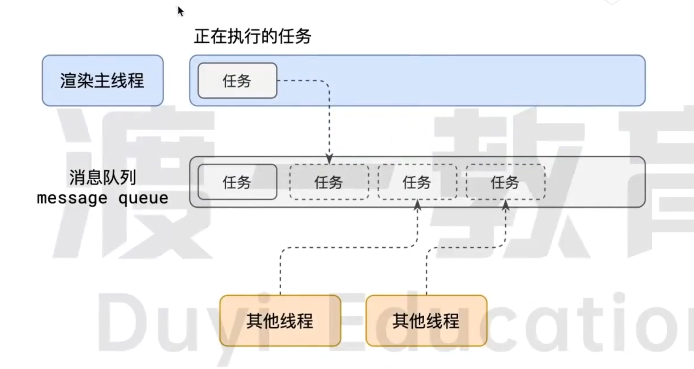
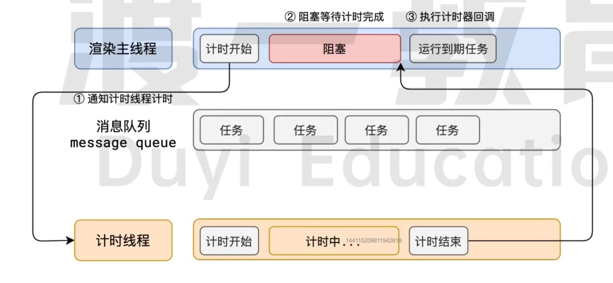
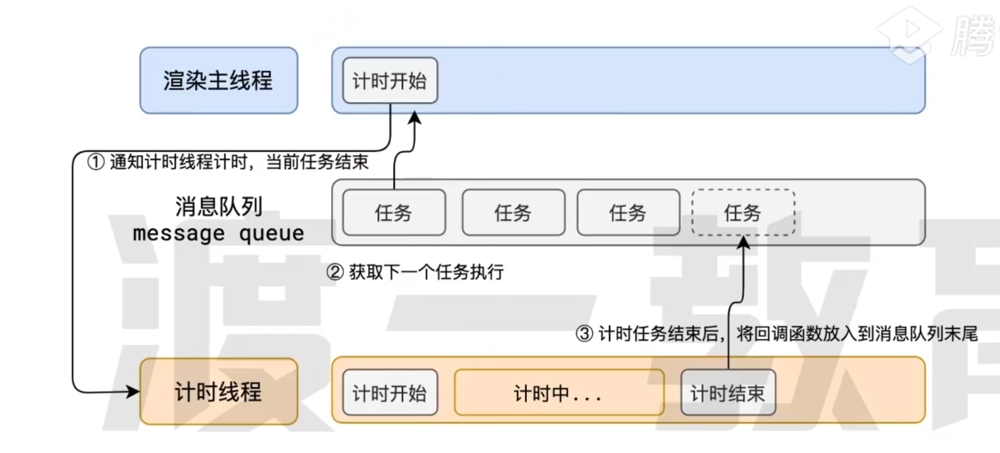

# 事件循环

## 浏览器进程模型

### 何为进程

程序运行需要有专属的内存空间，可以把这块内存空间理解为进程。



**每个应用至少有一个进程，进程之间相互独立，即使要通信，也需要对方同意**

### 何为线程

有了进程以后，就可以运行程序的代码了

运行代码的 《人》 称之为 《线程》

一个进程至少有一个线程，所以在进程开启后会自动创建一个线程来运行代码，该线程称为**主线程**（主线程结束，整个程序结束）

如果程序需要同时执行多块代码，主线程就会启动更多的线程来执行代码，所以一个进程包含多个线程



### 浏览器有哪些进程和线程

浏览器是一个多进程多线程的应用程序

浏览器内部工作极其复杂

为了避免相互影响，为了减少连环崩溃的几率，当启动浏览器后，他会自动启动多个进程



**包括但不限于渲染进程、网络进程、浏览器进程（可在浏览器任务管理器查看）**

#### 浏览器进程

主要负责页面展示（标签、地址栏等）、用户交互（滚动条、鼠标、键盘）、子进程管理（启动其他进程-网络、渲染等）等。浏览器进程内部会启动多个线程处理不同的任务。

#### 网络进程

负责加载网络资源。网络进程内部会启动多个线程处理不同的任务。

#### 渲染进程（重点）

渲染进程启动后会开启一个**渲染主线程**，主线程负责执行HTML、CSS、JS代码。

默认情况下，浏览器会为每个标签页开启一个新的渲染进程，以保证不同的标签页之间不相互影响


## 渲染主线程是如何工作的

渲染主线程是浏览器中最繁忙的线程，需要他处理的任务包括但不限于

- 解析HTML
- 解析CSS
- 计算样式
- 布局
- 处理图层
- 每秒把页面画60次 FPS
- 执行全局JS代码
- 执行事件处理函数
- 执行计时器回调函数
- .....


要处理这么多任务，主线程该如何调度任务？

- 我正在执行JS函数，执行到一半的时候用户点击了某个按钮，我该立即去执行点击事件的处理函数吗？
- 我正在执行JS函数，执行到一半的时候某个计时器到达了时间，我该立即去执行它的回调吗？
- 浏览器进程通知我“用户点击了按钮”，与此同时，某个计时器也到达了时间，我应该处理哪一个？
- ....

渲染主线程想到了：**排队**




1. 最开始的时候，渲染主线程会进入一个无限循环
2. 每一次循环会检查消息队列是否有任务存在。如果有，就取出第一个任务执行，执行完一个后进入下一次循环；如果没有，则进入休眠模式。
3. 其他所有线程（**包括其他进程的线程**）可以随时向消息列表添加任务。新任务会加到消息队列的末尾。在添加新任务时，如果主线程是休眠状态，则会将其唤醒以继续循环拿取任务

**整个过程就称为事件循环（消息循环）**

## 若干解释

### 何为异步

代码在执行过程中，会遇到一些无法立即处理的任务，比如：

- 计时完成后需要执行的任务： setTimeout、setInterval
- 网络通信完成后需要执行的任务：XHR、Fetch
- 用户操作后需要执行的任务：addEventListener

如果渲染主线程等待这些任务的时机达到，就会导致主线程长期处于**阻塞**的状态，从而导致浏览器**卡死**，这便是同步



**渲染主线程承担着极其重要的工作，无论如何都不能阻塞**

因此，浏览器选择用**异步**来解决这个问题



>>**如何解释JS异步？**<br/>
JS是一门单线程的语言，这是因为它运有在浏览器的渲染主线程中，而渲染主线程而渲染主线程承担着诸多的工作，渲染页面、执行 JS 都在其中运行。线程产生阻塞，从而导致消息队列中的很多如果使用同步的方式，就极有可能导致主其他任务无法得到执行白的消耗时间，另一方面导致页面无法及更新，给用户造成卡死现这样一来，一方面会导致繁忙的主线程户象。
所以浏览器采用异步的方式来避免。具体做法是当某些任务发生时，比如计时器、网络、事件监听，主线程将任务的执行，转而执行后续代码。当其他结任务交给其他线程去处理，自身立即结束程完成时，将事先传递的末尾排队，等待主线程调度执行回调函数包装成任务，加入到消息队列的在这种异步模式下，浏览器永不阻塞5209而最大限度的保证了单线程的流畅运行

### JS为何会阻塞代码

因为所有任务都是在渲染主线程中执行，当遇到执行时间过长的JS代码时，便会发生阻塞。

### 任务有优先级吗

任务没有优先级，在消息队列中先进先出

但**消息队列是有优先级的**

根据W3C的最新解释：
  - 每个任务都有一个任务类型，同一个类型的任务必须在一个队列，不同类型的任务可以分属于不同的队列，在一次事件循环中，浏览器可以根据实际情况从不同的队列中取出任务执行
  - 浏览器必须准备好一个微队列，微队列中的任务优先所有其他任务执行

<br/>

>> 随着浏览器的复杂度急剧提升，W3C不再使用宏队列说法

<br/>

目前chrome浏览器至少包含了下面的队列

 - 延时队列：用于存放计时器到达后的回调任务，优先级【中】
 - 交互队列：用于存放用户操作后产生的事件处理程序，优先级【高】
 - 微队列：用于存放需要最快执行的任务，优先级【最高】

>> 添加任务到微队列的主要方式是Promise、MutationObserver
例如： 
 ```js 
  // 立即把一个函数添加到微队列
  Promise.resolve().then(函数)
 ```

<br/>

 >> 浏览器还有很多其他队列，与开发关系不大，不做考虑

<br/>

 >> 阐述一下JS的事件循环
 参考答案： 事件循环又叫做消息循环（官方的叫法叫做event loop，浏览器内部实现叫message loop），是浏览器渲染主线程的工作方式
    在 Chrome 的源码中，它开启一个不会结束的 for 循环，每次循环从消息队列中取出第一个任务执行，而其他线程只需要在合适的时候将任务加入到队列末尾即可。<br/>
    过去把消息队列简单分为宏队列和微队列这种说法目前已无法满足复杂的浏览器环境，取而代之的是一种更加灵活多变的处理方式。<br/>
    根据 W3C官方的解释，每个任务有不同的类型，同类型的任务必须在同一个队列不同的任务可以属于不同的队列。不同任务队列有不同的优先级,在一次事件循环中，由浏览器自行决定取哪个队列的任务。但浏览器必须有一个微队列，微队列的任务一定具有最高的优先级，必须优先调度执行

<br/>

>> JS中的计时器能做到精准计时吗？为什么？
    参考答案：不行，因为：
    1. 计算机硬件没有原子钟，无法做到精准计时
    2. 操作系统的计时函数本身就有少量偏差，由于JS的计时器最终调用的是操作系统的函数，也就携带了这些偏差
    3. 按照 W3C的标准，浏览器实现计时器时，如果嵌套层级超过 5 层，则会带有4毫秒的最少时间， 这样在计时时间少于4毫秒时又带来了偏差。
    4. 受事件循环的影响，计时器的回调函只能在主线程空闲时运行，因此又带来了偏差