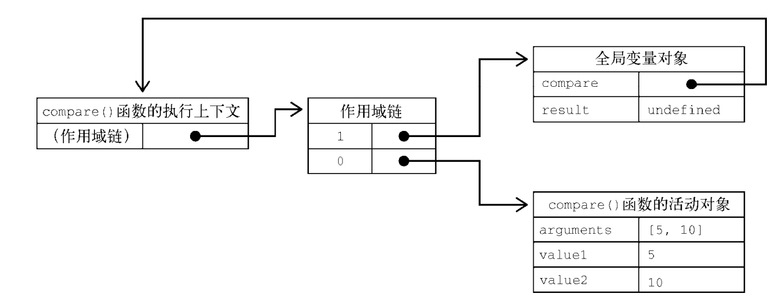
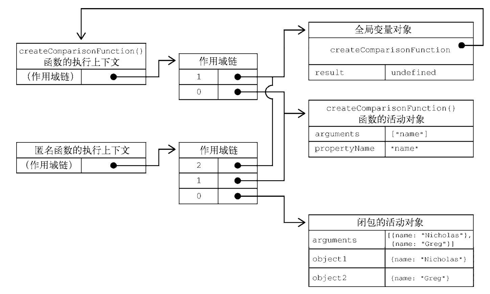

# JS中的函数

函数是ECMAScript中最有意思的部分之一，这主要是因为函数实际上是对象。每个函数都是Function类型的实例，而 Function 也有属性和方法，跟其他引用类型一样。因为函数是对象，所以函数名就是指向函数对象的指针，而且不一定与函数本身紧密绑定。

## 函数的定义

一、函数通常以函数声明的方式定义

```js
function sum (num1, num2) { 
 return num1 + num2; 
} 
```

二、 另一种定义函数的语法是函数表达式。函数表达式与函数声明几乎是等价的

```js
let sum = function(num1, num2) { 
 return num1 + num2; 
}; 
```

三、 还有一种定义函数的方式与函数表达式很像，叫作“箭头函数”（arrow function）

```js
let sum = (num1, num2) => { 
 return num1 + num2; 
};
```

四、最后一种定义函数的方式是使用 Function 构造函数。这个构造函数接收任意多个字符串参数，最后一个参数始终会被当成函数体，而之前的参数都是新函数的参数。

```js
let sum = new Function("num1", "num2", "return num1 + num2"); // 不推荐
```

## 箭头函数

ECMAScript 6 新增了使用胖箭头（=>）语法定义函数表达式的能力。很大程度上，箭头函数实例化的函数对象与正式的函数表达式创建的函数对象行为是相同的。任何可以使用函数表达式的地方，都可以使用箭头函数：

```js
let arrowSum = (a, b) => { 
 return a + b; 
}; 
let functionExpressionSum = function(a, b) { 
 return a + b; 
}; 
console.log(arrowSum(5, 8)); // 13 
console.log(functionExpressionSum(5, 8)); // 13 

// 箭头函数简洁的语法非常适合嵌入函数的场景

let ints = [1, 2, 3]; 
console.log(ints.map(function(i) { return i + 1; })); // [2, 3, 4] 
console.log(ints.map((i) => { return i + 1 })); // [2, 3, 4] 

// 如果只有一个参数，那也可以不用括号。只有没有参数，或者多个参数的情况下，才需要使用括号

// 以下两种写法都有效
let double = (x) => { return 2 * x; }; 
let triple = x => { return 3 * x; }; 
// 没有参数需要括号
let getRandom = () => { return Math.random(); }; 
// 多个参数需要括号
let sum = (a, b) => { return a + b; }; 
// 无效的写法：
let multiply = a, b => { return a * b; }; 

//箭头函数也可以不用大括号，但这样会改变函数的行为。
// 使用大括号就说明包含“函数体”，可以在一个函数中包含多条语句，跟常规的函数一样。
// 如果不使用大括号，那么箭头后面就只能有一行代码，比如一个赋值操作，或者一个表达式。而且，省略大括号会隐式返回这行代码的值

// 以下两种写法都有效，而且返回相应的值
let double = (x) => { return 2 * x; }; 
let triple = (x) => 3 * x; 
// 可以赋值
let value = {}; 
let setName = (x) => x.name = "Matt"; 
setName(value); 
console.log(value.name); // "Matt" 
// 无效的写法：
let multiply = (a, b) => return a * b; 

```

箭头函数虽然语法简洁，但也有很多场合不适用。箭头函数不能使用 arguments、super 和new.target，也不能用作构造函数。此外，箭头函数也没有 prototype 属性。

## 函数名

函数名就是指向函数的指针，所以它们跟其他包含对象指针的变量具有相同的行为。这意味着一个函数可以有多个名称

```js
function sum(num1, num2) { 
 return num1 + num2; 
} 
console.log(sum(10, 10)); // 20 
let anotherSum = sum; 
console.log(anotherSum(10, 10)); // 20 
sum = null; 
console.log(anotherSum(10, 10)); // 20 
```

以上代码定义了一个名为 sum()的函数，用于求两个数之和。然后又声明了一个变量 anotherSum，并将它的值设置为等于 sum。

**注意，使用不带括号的函数名会访问函数指针，而不会执行函数。**

此时，anotherSum 和 sum 都指向同一个函数。调用 anotherSum()也可以返回结果。把 sum 设置为 null之后，就切断了它与函数之间的关联。而 anotherSum()还是可以照常调用，没有问题。


ECMAScript 6 的所有函数对象都会暴露一个只读的 name 属性，其中包含关于函数的信息。多数情况下，这个属性中保存的就是一个函数标识符，或者说是一个字符串化的变量名。即使函数没有名称，也会如实显示成空字符串。**如果它是使用 Function 构造函数创建的，则会标识成"anonymous"：**

```js
function foo() {} 
let bar = function() {}; 
let baz = () => {}; 
console.log(foo.name); // foo 
console.log(bar.name); // bar 
console.log(baz.name); // baz 
console.log((() => {}).name); //（空字符串）
console.log((new Function()).name); // anonymous 
```

如果函数是一个获取函数、设置函数，或者使用 bind()实例化，那么标识符前面会加上一个前缀

```js
function foo() {} 
console.log(foo.bind(null).name); // bound foo 
let dog = { 
 years: 1, 
 get age() { 
   return this.years; 
 }, 
 set age(newAge) { 
   this.years = newAge; 
 } 
} 
let propertyDescriptor = Object.getOwnPropertyDescriptor(dog, 'age'); 
console.log(propertyDescriptor.get.name); // get age 
console.log(propertyDescriptor.set.name); // set age 

```

## 理解参数（arguments）

ECMAScript 函数的参数跟大多数其他语言不同。

ECMAScript 函数既不关心传入的参数个数，也不关心这些参数的数据类型。

定义函数时要接收两个参数，并不意味着调用时就传两个参数。

你可以传一个、三个，甚至一个也不传，解释器都不会报错。

**主要是因为 ECMAScript 函数的参数在内部表现为一个数组。**

函数被调用时总会接收一个数组，但函数并不关心这个数组中包含什么。如果数组中什么也没有，那没问题；如果数组的元素超出了要求，那也没问题。事实上，在使用 function 关键字定义（非箭头）函数时，可以在函数内部访问 arguments 对象，从中取得传进来的每个参数值。

arguments 对象是一个类数组对象（但不是 Array 的实例），因此可以使用中括号语法访问其中的元素（第一个参数是 arguments[0]，第二个参数是 arguments[1]）。而要确定传进来多少个参数，可以访问 arguments.length 属性。

<span style='color:red'>arguments.length会排除掉有默认值的属性</span>

```js
// 在下面的例子中，sayHi()函数的第一个参数叫 name：
function sayHi(name, message) { 
 console.log("Hello " + name + ", " + message); 
} 
// 可以通过 arguments[0]取得相同的参数值。因此，把函数重写成不声明参数也可以：
function sayHi() { 
 console.log("Hello " + arguments[0] + ", " + arguments[1]); 
}
```

在重写后的代码中，没有命名参数。name 和 message 参数都不见了，但函数照样可以调用。这就表明，ECMAScript 函数的参数只是为了方便才写出来的，并不是必须写出来的。

与其他语言不同，在ECMAScript 中的命名参数不会创建让之后的调用必须匹配的函数签名。这是因为根本不存在验证命名参数的机制。

也可以通过 arguments 对象的 length 属性检查传入的参数个数。

```js
// 下面的例子展示了在每调用一个函数时，都会打印出传入的参数个数
function howManyArgs() { 
 console.log(arguments.length); 
} 
howManyArgs("string", 45); // 2 
howManyArgs(); // 0 
howManyArgs(12); // 1


// 这个函数 doAdd()在只传一个参数时会加 10，在传两个参数时会将它们相加，然后返回。

function doAdd() { 
 if (arguments.length === 1) { 
 console.log(arguments[0] + 10); 
 } else if (arguments.length === 2) { 
 console.log(arguments[0] + arguments[1]); 
 } 
} 
doAdd(10); // 20 
doAdd(30, 20); // 50 
```

**还有一个必须理解的重要方面，那就是 arguments 对象可以跟命名参数一起使用**

```js
function doAdd(num1, num2) { 
 if (arguments.length === 1) { 
 console.log(num1 + 10); 
 } else if (arguments.length === 2) { 
 console.log(arguments[0] + num2); 
 } 
} 
```

**arguments 对象的另一个有意思的地方就是，它的值始终会与对应的命名参数同步**

```js

// 这个 doAdd()函数把第二个参数的值重写为 10。因为 arguments 对象的值会自动同步到对应的命名参数，所以修改 arguments[1]也会修改 num2 的值，因此两者的值都是 10。但这并不意味着它们都访问同一个内存地址，它们在内存中还是分开的，只不过会保持同步而已。

function doAdd(num1, num2) { 
 arguments[1] = 10; 
 console.log(arguments[0] + num2); 
} 
```

<span style='color:red'>如果只传了一个参数，然后把 arguments[1]设置为某个值，那么这个值并不会反映到第二个命名参数。因为 arguments 对象的长度是根据传入的参数个数，而非定义函数时给出的命名参数个数确定的</span>

对于命名参数而言，如果调用函数时没有传这个参数，那么它的值就是 undefined。这就类似于定义了变量而没有初始化。比如，如果只给 doAdd()传了一个参数，那么 num2 的值就是 undefined。

严格模式下，arguments 会有一些变化。

- 首先，像前面那样给 arguments[1]赋值不会再影响 num2的值。就算把 arguments[1]设置为 10，num2 的值仍然还是传入的值。
- 其次，在函数中尝试重写arguments 对象会导致语法错误。（代码也不会执行）

### 箭头函数中的参数

**如果函数是使用箭头语法定义的，那么传给函数的参数将不能使用 arguments 关键字访问，而只能通过定义的命名参数访问。**

```js
function foo() { 
 console.log(arguments[0]); 
} 
foo(5); // 5 
let bar = () => { 
 console.log(arguments[0]); 
}; 
bar(5); // ReferenceError: arguments is not defined 

// 虽然箭头函数中没有 arguments 对象，但可以在包装函数中把它提供给箭头函数：

function foo() { 
 let bar = () => { 
   console.log(arguments[0]); // 5 
 }; 
 bar(); 
} 
foo(5); 

```

## 没有重载（同一函数参数列表不一样）

ECMAScript 函数不能像传统编程那样重载。在其他语言比如 Java 中，一个函数可以有两个定义，只要签名（接收参数的类型和数量）不同就行。

如前所述，ECMAScript 函数没有签名，因为参数是由包含零个或多个值的数组表示的。没有函数签名，自然也就没有重载。

如果在 ECMAScript 中定义了两个同名函数，则后定义的会覆盖先定义的。

```js
function addSomeNumber(num) { 
 return num + 100; 
} 
function addSomeNumber(num) { 
 return num + 200; 
} 
let result = addSomeNumber(100); // 300
```

### 重载的解决方案（进阶）

#### 利用arguments对象实现

判断参数列表长度,执行不同逻辑

```js

function getUser(...args) {
  if(args.length == 0 ) {
    console.log('查询所有用户')
  } else if (args.length == 1) {
    console.log('查询第n页的用户，默认为10')
  }else if (args.length == 2) {
    consolelog('查询第n页的用户，限定值为x')
  }
}

getUser() // 查询所有用户
getUser(1) // 查询第1页的10个用户
getUser(1, 20) // 查询第1页的20个用户

```

##### 问题

代码结构复杂

#### Jquery的解决方案

Jquery利用对象和函数闭包的特性实现了一个addMethod函数，大致如下

```js
// Jquery 重载实现
function addMethod(Object, name ,fn) {
  const old = object[name] // 先获取到同名方法
  object[name] = function(...args) {
    if(args.length == fn.length) {
      return fn.apply(this, args)
    } else {
      return old.apply(this, args)
    }
  }
}

const Users = {}

addMethod(Users, 'getUser', ()=>{
    console.log('查询所有用户')
})

addMethod(Users, 'getUser', (page)=>{
    console.log(`查询第${page}页的用户`)
})

addMethod(Users, 'getUser', (page, limit)=>{
    console.log(`查询第${page}页的共${limit * page}个用户`)
})

Users.getUser(10,2)
```

##### 问题

- 定义、调用麻烦（需要通过对象）
- 不能设置参数默认值
- 只能适配参数数量一致的情况，无法适应参数类型不同的情况

#### 推荐方法

```js
function createOverload() {
  const callMap = new Map()
  // 要重载的函数
  function overload(...args) {
    const key = args.map(arg => typeof arg).join(',')
    const fn = callMap.get(key)
    if(fn) {
      return fn.apply(this, args)
    }
  }
  // 添加重载
  overload.addImpl = function(...args) {
    // 无论多少个参数，最后一个为函数
    const fn = args.pop()
    if(typeof fn != 'function') {
      return;
    }
    const types = args // 拿到参数列表
    callMap.set(types.join(','), fn)
  }

  return overload
}

const getUser = createOverload()

getUser.addImpl('number', (page)=> {
    console.log(`查询第${page}页的用户`)
})

```

## 默认参数值

- 在 ECMAScript5.1 及以前，实现默认参数的一种常用方式就是检测某个参数是否等于 undefined，如果是则意味着没有传这个参数，那就给它赋一个值：

```js
function makeKing(name) { 
 name = (typeof name !== 'undefined') ? name : 'Henry'; 
 return `King ${name} VIII`; 
} 
console.log(makeKing()); // 'King Henry VIII' 
console.log(makeKing('Louis')); // 'King Louis VIII'
```

- ECMAScript 6 之后就不用这么麻烦了，因为它支持显式定义默认参数了。

```js
function makeKing(name = 'Henry') { 
 return `King ${name} VIII`; 
} 
console.log(makeKing('Louis')); // 'King Louis VIII' 
console.log(makeKing()); // 'King Henry VIII' 
```

- 给参数传 undefined 相当于没有传值，不过这样可以利用多个独立的默认值

```js
function makeKing(name = 'Henry', numerals = 'VIII') { 
 return `King ${name} ${numerals}`; 
} 
console.log(makeKing()); // 'King Henry VIII' 
console.log(makeKing('Louis')); // 'King Louis VIII' 
console.log(makeKing(undefined, 'VI')); // 'King Henry VI' 
```

- 在使用默认参数时，arguments 对象的值不反映参数的默认值，只反映传给函数的参数。(arguments不显示默认值，length也不计算)

```js
function makeKing(name = 'Henry') { 
 name = 'Louis'; 
 return `King ${arguments[0]}`; 
} 
console.log(makeKing()); // 'King undefined' 
console.log(makeKing('Louis')); // 'King Louis' 
```

- **默认参数值也可以是调用函数返回的值**

```js
let romanNumerals = ['I', 'II', 'III', 'IV', 'V', 'VI']; 
let ordinality = 0; 
function getNumerals() { 
 // 每次调用后递增
 return romanNumerals[ordinality++]; 
} 
function makeKing(name = 'Henry', numerals = getNumerals()) { 
 return `King ${name} ${numerals}`; 
} 
console.log(makeKing()); // 'King Henry I'
console.log(makeKing('Louis', 'XVI')); // 'King Louis XVI' 
console.log(makeKing()); // 'King Henry II' 
console.log(makeKing()); // 'King Henry III'
```

**函数的默认参数只有在函数被调用时才会求值，不会在函数定义时求值。而且，计算默认值的函数只有在调用函数但未传相应参数时才会被调用**

箭头函数同样也可以这样使用默认参数，只不过在只有一个参数时，就必须使用括号而不能省略了

```js
let makeKing = (name = 'Henry') => `King ${name}`; 
console.log(makeKing()); // King Henry
```

### 默认参数作用域与暂时性死区

因为在求值默认参数时可以定义对象，也可以动态调用函数，所以函数参数肯定是在某个作用域中求值的

给多个参数定义默认值实际上跟使用 let 关键字顺序声明变量一样。

```js
function makeKing(name = 'Henry', numerals = 'VIII') { 
 return `King ${name} ${numerals}`; 
} 
console.log(makeKing()); // King Henry VIII 

// 这里的默认参数会按照定义它们的顺序依次被初始化。
function makeKing() { 
 let name = 'Henry'; 
 let numerals = 'VIII'; 
 return `King ${name} ${numerals}`; 
} 

// 因为参数是按顺序初始化的，所以后定义默认值的参数可以引用先定义的参数。
function makeKing(name = 'Henry', numerals = name) { 
 return `King ${name} ${numerals}`; 
} 
console.log(makeKing()); // King Henry Henry 
```

参数初始化顺序遵循“暂时性死区”规则，即前面定义的参数不能引用后面定义的。

```js
// 调用时不传第一个参数会报错
function makeKing(name = numerals, numerals = 'VIII') { 
 return `King ${name} ${numerals}`; 
} 

```

参数也存在于自己的作用域中，它们不能引用函数体的作用域

```js
// 调用时不传第二个参数会报错
function makeKing(name = 'Henry', numerals = defaultNumeral) { 
 let defaultNumeral = 'VIII'; 
 return `King ${name} ${numerals}`; 
} 

```

## 参数拓展与收集

ECMAScript 6 新增了扩展操作符，使用它可以非常简洁地操作和组合集合数据。（...）扩展操作符最有用的场景就是函数定义中的参数列表，在这里它可以充分利用这门语言的弱类型及参数长度可变的特点。扩展操作符既可以用于调用函数时传参，也可以用于定义函数参数。

### 拓展参数

在给函数传参时，有时候可能不需要传一个数组，而是要分别传入数组的元素

```js
// 假设有如下函数定义，它会将所有传入的参数累加起来：
let values = [1, 2, 3, 4]; 
function getSum() { 
 let sum = 0; 
 for (let i = 0; i < arguments.length; ++i) { 
 sum += arguments[i]; 
 } 
 return sum; 
}

// 在使用扩展符之前，只能使用apply方法

console.log(getSum.apply(null, values)); // 10 

// 但是现在可以使用拓展符

console.log(getSum(...values)); // 10

// 因为数组的长度已知，所以在使用扩展操作符传参的时候，并不妨碍在其前面或后面再传其他的值，包括使用扩展操作符传其他参数

console.log(getSum(-1, ...values)); // 9 
console.log(getSum(...values, 5)); // 15 
console.log(getSum(-1, ...values, 5)); // 14 
console.log(getSum(...values, ...[5,6,7])); // 28

// 对函数中的 arguments 对象而言，它并不知道扩展操作符的存在，而是按照调用函数时传入的参数接收每一个值

let values = [1,2,3,4] 
function countArguments() { 
 console.log(arguments.length); 
} 
countArguments(-1, ...values); // 5 
countArguments(...values, 5); // 5 
countArguments(-1, ...values, 5); // 6 
countArguments(...values, ...[5,6,7]); // 7

```

arguments 对象只是消费扩展操作符的一种方式。在普通函数和箭头函数中，也可以将扩展操作符用于命名参数，当然同时也可以使用默认参数

```js
function getProduct(a, b, c = 1) { 
 return a * b * c; 
} 
let getSum = (a, b, c = 0) => { 
 return a + b + c; 
} 
console.log(getProduct(...[1,2])); // 2 
console.log(getProduct(...[1,2,3])); // 6 
console.log(getProduct(...[1,2,3,4])); // 6 
console.log(getSum(...[0,1])); // 1 
console.log(getSum(...[0,1,2])); // 3 
console.log(getSum(...[0,1,2,3])); // 3 
```

## 收集参数

在构思函数定义时，可以使用扩展操作符把不同长度的独立参数组合为一个数组。

```js
function getSum(...values) { 
 // 顺序累加 values 中的所有值
 // 初始值的总和为 0 
 return values.reduce((x, y) => x + y, 0); 
} 
console.log(getSum(1,2,3)); // 6
```

收集参数的前面如果还有命名参数，则只会收集其余的参数；如果没有则会得到空数组。因为收集参数的结果可变，所以只能把它作为最后一个参数

```js
// 不可以
function getProduct(...values, lastValue) {} 
// 可以
function ignoreFirst(firstValue, ...values) { 
 console.log(values); 
} 
ignoreFirst(); // [] 
ignoreFirst(1); // [] 
ignoreFirst(1,2); // [2] 
ignoreFirst(1,2,3); // [2, 3] 
```

箭头函数虽然不支持 arguments 对象，但支持收集参数的定义方式，因此也可以实现与使用arguments 一样的逻辑

```js
let getSum = (...values) => { 
 return values.reduce((x, y) => x + y, 0); 
} 
console.log(getSum(1,2,3)); // 6 
```

另外，使用收集参数并不影响 arguments 对象，它仍然反映调用时传给函数的参数：

```js
function getSum(...values) { 
 console.log(arguments.length); // 3 
 console.log(arguments); // [1, 2, 3] 
 console.log(values); // [1, 2, 3] 
} 
console.log(getSum(1,2,3));
```

## 函数声明与函数表达式

事实上，JavaScript 引擎在加载数据时对函数声明和函数表达式是区别对待的。

- JavaScript 引擎在任何代码执行之前，会先读取函数声明，并在执行上下文中生成函数定义。
- 而函数表达式必须等到代码执行到它那一行，才会在执行上下文中生成函数定义。

```js
// 没问题  因为函数声明会在任何代码执行之前先被读取并添加到执行上下文。这个过程叫作函数声明提升（function declaration hoisting）。
console.log(sum(10, 10)); 
function sum(num1, num2) { 
 return num1 + num2; 
}
// 会出错 因为这个函数定义包含在一个变量初始化语句中，而不是函数声明中
console.log(sum(10, 10)); 
let sum = function(num1, num2) { 
 return num1 + num2; 
}; 
```

## 函数作为值

因为函数名在 ECMAScript 中就是变量，所以函数可以用在任何可以使用变量的地方。这意味着不仅可以把函数作为参数传给另一个函数，而且还可以在一个函数中返回另一个函数。

```js
// 这个函数接收两个参数。第一个参数应该是一个函数，第二个参数应该是要传给这个函数的值。
function callSomeFunction(someFunction, someArgument) { 
 return someFunction(someArgument); 
} 

function add10(num) { 
 return num + 10; 
} 
let result1 = callSomeFunction(add10, 10); 
console.log(result1); // 20 
function getGreeting(name) { 
 return "Hello, " + name; 
} 
let result2 = callSomeFunction(getGreeting, "Nicholas"); 
console.log(result2); // "Hello, Nicholas"
```

从一个函数中返回另一个函数也是可以的，而且非常有用。

```js
// 有一个包含对象的数组，而我们想按照任意对象属性对数组进行排序。
function createComparisonFunction(propertyName) { 
 return function(object1, object2) { 
  let value1 = object1[propertyName]; 
  let value2 = object2[propertyName]; 
  if (value1 < value2) { 
    return -1; 
  } else if (value1 > value2) { 
    return 1; 
  } else { 
    return 0; 
  } 
 }; 
} 

let data = [ 
 {name: "Zachary", age: 28}, 
 {name: "Nicholas", age: 29} 
]; 
data.sort(createComparisonFunction("name")); 
console.log(data[0].name); // Nicholas 
data.sort(createComparisonFunction("age")); 
console.log(data[0].name); // Zachary 

```


## 函数内部

在 ECMAScript 5 中，函数内部存在两个特殊的对象：arguments 和 this。ECMAScript 6 又新增了 new.target 属性。

### arguments

它是一个类数组对象，包含调用函数时传入的所有参数。

这个对象只有以 function 关键字定义函数（相对于使用箭头语法创建函数）时才会有。

虽然主要用于包含函数参数，但 arguments 对象其实还有一个 callee 属性，是一个指向 arguments 对象所在函数的指针。

```js
// 阶乘
function factorial(num) { 
 if (num <= 1) { 
 return 1; 
 } else { 
 return num * factorial(num - 1); 
 } 
} 

//使用 arguments.callee 就可以让函数逻辑与函数名解耦

function factorial(num) { 
 if (num <= 1) { 
 return 1; 
 } else { 
 return num * arguments.callee(num - 1); 
 } 
}
```

### this

另一个特殊的对象是 this，它在标准函数和箭头函数中有不同的行为。

- 在标准函数中，this 引用的是把函数当成方法调用的上下文对象，这时候通常称其为 this 值（在网页的全局上下文中调用函数时，this 指向 windows）。

```js
window.color = 'red'; 
let o = { 
 color: 'blue' 
}; 
function sayColor() { 
 console.log(this.color); 
} 
sayColor(); // 'red' 
o.sayColor = sayColor; 
o.sayColor(); // 'blue'(此时的this指向 对象o)
```

- 在箭头函数中，this引用的是**定义**箭头函数的上下文。

```js
window.color = 'red'; 
let o = { 
 color: 'blue' 
}; 
let sayColor = () => console.log(this.color); 
sayColor(); // 'red' 
o.sayColor = sayColor; 
o.sayColor(); // 'red'
```

- 在事件回调或定时回调中调用某个函数时，this 值指向的并非想要的对象。此时将回调函数写成箭头函数就可以解决问题。这是因为箭头函数中的 this 会保留定义该函数时的上下文

```js
function King() { 
 this.royaltyName = 'Henry'; 
 // this 引用 King 的实例
 setTimeout(() => console.log(this.royaltyName), 1000); 
} 

function Queen() { 
 this.royaltyName = 'Elizabeth'; 
 // this 引用 window 对象
 setTimeout(function() { console.log(this.royaltyName); }, 1000); 
} 
new King(); // Henry 
new Queen(); // undefined 
```

### caller

ECMAScript 5 也会给函数对象上添加一个属性：caller。虽然 ECMAScript 3 中并没有定义，但所有浏览器除了早期版本的 Opera 都支持这个属性。这个属性引用的是调用当前函数的函数，或者如果是在全局作用域中调用的则为 null。

```js
// 以下代码会显示 outer()函数的源代码。这是因为 ourter()调用了 inner()，inner.caller指向 outer()
function outer() { 
 inner(); 
} 
function inner() { 
 console.log(inner.caller); 
} 
outer();  // function outer() { inner(); } 

// 如果要降低耦合度，则可以通过 arguments.callee.caller 来引用同样的值：
function outer() { 
 inner(); 
} 
function inner() { 
 console.log(arguments.callee.caller); 
} 
outer(); 
```

### new.target

ECMAScript 中的函数始终可以作为构造函数实例化一个新对象，也可以作为普通函数被调用。

ECMAScript 6 新增了检测函数是否使用 new 关键字调用的 new.target 属性。

如果函数是正常调用的，则 new.target 的值是 undefined；如果是使用 new 关键字调用的，则 new.target 将引用被调用的构造函数。


```js
function King() { 
 if (!new.target) { 
 throw 'King must be instantiated using "new"' 
 } 
 console.log('King instantiated using "new"'); 
} 
new King(); // King instantiated using "new" 
King(); // Error: King must be instantiated using "new"
```

## 函数属性与方法

ECMAScript 中的函数是对象，因此有属性和方法。每个函数都有两个属性：length和 prototype。

- length 属性保存函数定义的命名参数的个数

```js
function sayName(name) { 
 console.log(name); 
} 
function sum(num1, num2) { 
 return num1 + num2; 
} 
function sayHi() { 
 console.log("hi"); 
} 
console.log(sayName.length); // 1 
console.log(sum.length); // 2 
console.log(sayHi.length); // 0 
```

#### apply和call

- 函数还有两个方法：apply()和 call()。这两个方法都会以指定的 this 值来调用函数，即会设置调用函数时函数体内 this 对象的值。

apply()方法接收两个参数：函数内 this 的值和一个参数数组。第二个参数可以是 Array 的实例，但也可以是 arguments 对象

```js
function sum(num1, num2) { 
 return num1 + num2; 
} 
function callSum1(num1, num2) { 
 return sum.apply(this, arguments); // 传入 arguments 对象
}
function callSum2(num1, num2) { 
 return sum.apply(this, [num1, num2]); // 传入数组
} 
console.log(callSum1(10, 10)); // 20 
console.log(callSum2(10, 10)); // 20 
```

>> 在严格模式下，调用函数时如果没有指定上下文对象，则 this 值不会指向 window。除非使用 apply()或 call()把函数指定给一个对象，否则 this 的值会变成 undefined。

##### 区别

call()方法与 apply()的作用一样，只是传参的形式不同。第一个参数跟 apply()一样，也是 this值，而剩下的要传给被调用函数的参数则是逐个传递的。换句话说，通过 call()向函数传参时，必须将参数一个一个地列出来

```js
function sum(num1, num2) { 
 return num1 + num2; 
} 
function callSum(num1, num2) { 
 return sum.call(this, num1, num2); 
} 
console.log(callSum(10, 10)); // 20 
```

**如果想直接传 arguments对象或者一个数组，那就用 apply()；否则，就用 call()。当然，如果不用给被调用的函数传参，则使用哪个方法都一样。**

apply()和 call()真正强大的地方并不是给函数传参，而是控制函数调用上下文即函数体内 this值的能力。

```js
window.color = 'red'; 
let o = { 
 color: 'blue' 
}; 
function sayColor() { 
 console.log(this.color); 
} 
sayColor(); // red 
sayColor.call(this); // red 
sayColor.call(window); // red 
sayColor.call(o); // blue 
```

#### bind()

ECMAScript 5 出于同样的目的定义了一个新方法：bind()

bind()方法会创建一个新的函数实例，其 this 值会被绑定到传给 bind()的对象。

```js
window.color = 'red'; 
var o = { 
 color: 'blue' 
}; 
function sayColor() { 
 console.log(this.color); 
} 
let objectSayColor = sayColor.bind(o); 
objectSayColor(); // blue 
```

## 函数表达式


函数表达式虽然更强大，但也更容易让人迷惑。我们知道，定义函数有两种方式：函数声明和函数表达式。

- 函数声明

```js
function functionName(arg0, arg1, arg2) { 
 // 函数体 
} 
```

函数声明的关键特点是函数声明提升，即函数声明会在代码执行之前获得定义。这意味着函数声明可以出现在调用它的代码之后

```js
// 这个例子不会抛出错误，因为 JavaScript 引擎会先读取函数声明，然后再执行代码
sayHi(); 
function sayHi() { 
 console.log("Hi!"); 
}
```

- 函数表达式

```js
let functionName = function(arg0, arg1, arg2) { 
 // 函数体 
}; 
```

函数表达式看起来就像一个普通的变量定义和赋值，即创建一个函数再把它赋值给一个变量functionName。这样创建的函数叫作**匿名函数（anonymous funtion）**，因为 function 关键字后面没有
标识符。

未赋值给其他变量的匿名函数的 name 属性是空字符串

```js
sayHi(); // Error! function doesn't exist yet 
let sayHi = function() { 
 console.log("Hi!"); 
}; 
```

理解函数声明和函数表达式之间的区别，关键是理解提升

```js
// 千万别这样做！
if (condition) { 
 function sayHi() { 
 console.log('Hi!'); 
 } 
} else { 
 function sayHi() { 
 console.log('Yo!'); 
 } 
} 
```

这段代码看起来很正常，就是如果 condition 为 true，则使用第一个 sayHi()定义；否则，就使用第二个。

事实上，这种写法在 ECAMScript 中不是有效的语法。

JavaScript 引擎会尝试将其纠正为适当的声明。多数浏览器会忽略 condition 直接返回第二个声明。

**这种写法很危险，不要使用。** 不过，如果把上面的函数声明换成函数表达式就没问题了

```js
// 没问题 
let sayHi; 
if (condition) { 
 sayHi = function() { 
   console.log("Hi!"); 
 }; 
} else { 
 sayHi = function() { 
   console.log("Yo!"); 
 }; 
} 
```

## 递归

递归函数通常的形式是一个函数通过名称调用自己

```js
function factorial(num) { 
 if (num <= 1) { 
 return 1; 
 } else { 
 return num * factorial(num - 1); 
 } 
} 
```

这是经典的递归阶乘函数。虽然这样写是可以的，但如果把这个函数赋值给其他变量，就会出问题

```js
// 这里把 factorial()函数保存在了另一个变量 anotherFactorial 中，然后将 factorial 设置为 null，于是只保留了一个对原始函数的引用。而在调用 anotherFactorial()时，要递归调用factorial()，但因为它已经不是函数了，所以会出错。在写递归函数时使用 arguments.callee 可以避免这个问题。

let anotherFactorial = factorial; 
factorial = null; 
console.log(anotherFactorial(4)); // 报错
```

arguments.callee 就是一个指向正在执行的函数的指针，因此可以在函数内部递归调用

```js
function factorial(num) { 
 if (num <= 1) { 
 return 1; 
 } else { 
 return num * arguments.callee(num - 1); 
 } 
} 
```

**编写递归函数时, arguments.callee是引用当前函数的首选**

<span style='color:red'>不过，在严格模式下运行的代码是不能访问 arguments.callee 的，因为访问会出错。</span>

可以使用命名函数表达式（named function expression）达到目的

```js
// 这里创建了一个命名函数表达式 f()，然后将它赋值给了变量 factorial。即使把函数赋值给另一个变量，函数表达式的名称 f 也不变，因此递归调用不会有问题。这个模式在严格模式和非严格模式下都可以使用。
const factorial = (function f(num) { 
 if (num <= 1) { 
 return 1; 
 } else { 
 return num * f(num - 1); 
 } 
}); 
```

## 尾调用（指函数最后一个动作是返回另一个函数的运行结果）优化

ECMAScript 6 规范新增了一项内存管理优化机制，让 JavaScript 引擎在满足条件时可以重用栈帧。

```js
function outerFunction() { 
 return innerFunction(); // 尾调用
} 
```

- ES6优化之前

```
(1) 执行到 outerFunction 函数体，第一个栈帧被推到栈上。
(2) 执行 outerFunction 函数体，到 return 语句。计算返回值必须先计算 innerFunction。
(3) 执行到 innerFunction 函数体，第二个栈帧被推到栈上。
(4) 执行 innerFunction 函数体，计算其返回值。
(5) 将返回值传回 outerFunction，然后 outerFunction 再返回值。
(6) 将栈帧弹出栈外。
```

- ES6优化之后

```
(1) 执行到 outerFunction 函数体，第一个栈帧被推到栈上。
(2) 执行 outerFunction 函数体，到达 return 语句。为求值返回语句，必须先求值 innerFunction。
(3) 引擎发现把第一个栈帧弹出栈外也没问题，因为 innerFunction 的返回值也是 outerFunction的返回值。
(4) 弹出 outerFunction 的栈帧。
(5) 执行到 innerFunction 函数体，栈帧被推到栈上。
(6) 执行 innerFunction 函数体，计算其返回值。
(7) 将 innerFunction 的栈帧弹出栈外。
```

### 优化的条件

尾调用优化的条件就是确定外部栈帧真的没有必要存在了（即当前函数可以弹出栈）

具体条件如下：

- 代码在严格模式下执行；
- 外部函数的返回值是对尾调用函数的调用；
- 尾调用函数返回后不需要执行额外的逻辑
- 尾调用函数不是引用外部函数作用域中自由变量的闭包。

```js
"use strict"; 
// 无优化：尾调用没有返回 
function outerFunction() { 
 innerFunction(); 
} 
// 无优化：尾调用没有直接返回
function outerFunction() { 
 let innerFunctionResult = innerFunction(); 
 return innerFunctionResult; 
}
// 无优化：尾调用返回后必须转型为字符串
function outerFunction() { 
 return innerFunction().toString(); 
} 
// 无优化：尾调用是一个闭包
function outerFunction() { 
 let foo = 'bar'; 
 function innerFunction() { return foo; } 
 return innerFunction();
```

下面是几个符合尾调用优化条件的例子

```js
"use strict"; 
// 有优化：栈帧销毁前执行参数计算
function outerFunction(a, b) { 
 return innerFunction(a + b); 
} 
// 有优化：初始返回值不涉及栈帧
function outerFunction(a, b) { 
 if (a < b) { 
 return a; 
 } 
 return innerFunction(a + b); 
} 
// 有优化：两个内部函数都在尾部
function outerFunction(condition) { 
 return condition ? innerFunctionA() : innerFunctionB(); 
}
```

### 尾调用优化的代码

可以通过把简单的递归函数转换为待优化的代码来加深对尾调用优化的理解。

```js
// 无优化，因为返回后还有相加的操作
function fib(n) { 
 if (n < 2) { 
 return n; 
 } 
 return fib(n - 1) + fib(n - 2); 
} 
console.log(fib(0)); // 0 
console.log(fib(1)); // 1 
console.log(fib(2)); // 1 
console.log(fib(3)); // 2 
console.log(fib(4)); // 3 
console.log(fib(5)); // 5 
console.log(fib(6)); // 8 
```

```js
"use strict"; 
// 基础框架 
function fib(n) { 
 return fibImpl(0, 1, n); 
} 
// 执行递归
function fibImpl(a, b, n) { 
 if (n === 0) { 
 return a; 
 } 
 return fibImpl(b, a + b, n - 1); 
}

// 假设 fib(5) (0,1,4) => (1,1,3) => (1,2,2) => (2,3,1) =>(3,5,0) => 3
```

## 闭包

匿名函数经常被人误认为是闭包（closure）。

**闭包**指的是那些引用了另一个函数作用域中变量的函数，通常是在嵌套函数中实现的。

```js
// 闭包
function createComparisonFunction(propertyName) { 
 return function(object1, object2) { 
  let value1 = object1[propertyName];  // 加粗
  let value2 = object2[propertyName];  // 加粗
  if (value1 < value2) { 
    return -1; 
  } else if (value1 > value2) { 
    return 1; 
  } else { 
    return 0; 
  } 
  }; 
} 
```

这里加粗的代码位于内部函数（匿名函数）中，其中引用了外部函数的变量 propertyName。

在这个内部函数被返回并在其他地方被使用后，它仍然引用着那个变量。

这是因为内部函数的作用域链包含createComparisonFunction()函数的作用域。

闭包和作用域链的创建和使用密不可分[作用域链](./深入JavaScript变量、作用域及内存.html#执行上下文和作用域)

```
在调用一个函数时，会为这个函数调用创建一个上下文，并创建一个作用域链。

然后用arguments和其他命名参数来初始化这个函数的活动对象

外部函数的活动对象是内部函数作用域链上的第二个对象。

这个作用域链一直向外串起了所有包含函数的活动对象，直到全局执行上下文才终止。
```

```js
function compare(value1, value2) { 
 if (value1 < value2) { 
   return -1; 
 } else if (value1 > value2) { 
   return 1; 
 } else { 
   return 0; 
 } 
} 
let result = compare(5, 10); 
```

这里定义的 compare()函数是在全局上下文中调用的。

第一次调用 compare()时，会为它创建一个包含 arguments、value1 和 value2 的活动对象，这个对象是其作用域链上的第一个对象

全局上下文的变量对象则是 compare()作用域链上的第二个对象，其中包含 this、result 和 compare。

下图展现了上面的关系



函数内部的代码在访问变量时，就会使用给定的名称从作用域链中查找变量。函数执行完毕后，局部活动对象会被销毁，内存中就只剩下全局作用域。

不过，闭包就不一样了。

在一个函数内部定义的函数会把其包含函数的活动对象添加到自己的作用域链中。

因此，在createComparisonFunction()函数中，匿名函数的作用域链中实际上包含 createComparison-Function()的活动对象。

```js
let compare = createComparisonFunction('name'); 
let result = compare({ name: 'Nicholas' }, { name: 'Matt' });
```



```
在 createComparisonFunction()返回匿名函数后，它的作用域链被初始化为包含 create-ComparisonFunction()的活动对象和全局变量对象。

这样，匿名函数就可以访问到 createComparison-Function()可以访问的所有变量。

另一个有意思的副作用就是，createComparisonFunction()的活动对象并不能在它执行完毕后销毁，因为匿名函数的作用域链中仍然有对它的引用。

在 create-ComparisonFunction()执行完毕后，其执行上下文的作用域链会销毁，但它的活动对象仍然会保留在内存中，直到匿名函数被销毁后才会被销毁：
```

```js
// 创建比较函数
let compareNames = createComparisonFunction('name'); 
// 调用函数
let result = compareNames({ name: 'Nicholas' }, { name: 'Matt' }); 
// 解除对函数的引用，这样就可以释放内存了
compareNames = null; 

```

### this对象

在闭包中使用 this 会让代码变复杂。如果内部函数没有使用箭头函数定义，则 this 对象会在运行时绑定到执行函数的上下文。

如果在全局函数中调用，则 this 在非严格模式下等于 window，在严格模式下等于 undefined。

如果作为某个对象的方法调用，则 this 等于这个对象。

匿名函数在这种情况下不会绑定到某个对象，这就意味着 this 会指向 window，除非在严格模式下 this 是 undefined。

```js
// 这里先创建了一个全局变量 identity
window.identity = 'The Window'; 
// 又创建一个包含 identity 属性的对象
let object = { 
 identity: 'My Object', 
 // 一个 getIdentityFunc()方法，返回一个匿名函数
 getIdentityFunc() { 
   return function() { 
     return this.identity; 
   }; 
 } 
}; 
console.log(object.getIdentityFunc()()); // 'The Window' 
```

为什么匿名函数没有使用其包含作用域（getIdentityFunc()）的 this 对象呢？每个函数在被调用时都会自动创建两个特殊变量：this 和 arguments。内部函数永远不可能直接访问外部函数的这两个变量

```js
// 如果把 this 保存到闭包可以访问的另一个变量中则是行得通的
window.identity = 'The Window'; 
let object = { 
 identity: 'My Object', 
 getIdentityFunc() { 
   let that = this; 
   return function() { 
     return that.identity; 
   }; 
 } 
}; 
console.log(object.getIdentityFunc()()); // 'My Object'
```

在一些特殊情况下，this不是我们期望的值

```js
window.identity = 'The Window'; 
let object = { 
 identity: 'My Object', 
 getIdentity () { 
   return this.identity; 
 } 
};

object.getIdentity(); // 'My Object' 
(object.getIdentity)(); // 'My Object' 
// 行执行了一次赋值，然后再调用赋值后的结果赋值  表达式的值是函数本身，this 值不再与任何对象绑定
(object.getIdentity = object.getIdentity)(); // 'The Window' 
```

### 内存泄露

由于 IE 在 IE9 之前对 JScript 对象和 COM 对象使用了不同的垃圾回收机制[（第 4 章讨论过）](./%E6%B7%B1%E5%85%A5JavaScript%E5%8F%98%E9%87%8F%E3%80%81%E4%BD%9C%E7%94%A8%E5%9F%9F%E5%8F%8A%E5%86%85%E5%AD%98.md#垃圾回收)，所以
闭包在这些旧版本 IE 中可能会导致问题。在这些版本的 IE 中，把 HTML 元素保存在某个闭包的作用域中，就相当于宣布该元素不能被销毁。来看下面的例子

```js
function assignHandler() { 
 let element = document.getElementById('someElement'); 
 element.onclick = () => console.log(element.id); 
}
```

以上代码创建了一个闭包，即 element 元素的事件处理程序（事件处理程序将在第 13 章讨论）。而这个处理程序又创建了一个循环引用。匿名函数引用着 assignHandler()的活动对象，阻止了对
element 的引用计数归零。只要这个匿名函数存在，element 的引用计数就至少等于 1。也就是说，内存不会被回收。其实只要这个例子稍加修改，就可以避免这种情况

```js
function assignHandler() { 
 let element = document.getElementById('someElement'); 
 let id = element.id; 
 element.onclick = () => console.log(id);
 element = null; 
} 
```

## 立即调用的函数表达式

立即调用的匿名函数又被称作立即调用的函数表达式（IIFE，Immediately Invoked Function Expression）。它类似于函数声明，但由于被包含在括号中，所以会被解释为函数表达式。紧跟在第一组括号后面的第二组括号会立即调用前面的函数表达式。

```js
(function() { 
 // 块级作用域 
})();
```

使用 IIFE 可以模拟块级作用域，即在一个函数表达式内部声明变量，然后立即调用这个函数。

**ECMAScript 5 尚未支持块级作用域，使用 IIFE模拟块级作用域是相当普遍的。**

```js
// IIFE 
(function () { 
 for (var i = 0; i < count; i++) { 
 console.log(i); 
 } 
})(); 
console.log(i); // 抛出错误
```

在 ECMAScript 6 以后，IIFE 就没有那么必要了，因为块级作用域中的变量无须 IIFE 就可以实现同样的隔离

```js
// 内嵌块级作用域 
{ 
 let i; 
 for (i = 0; i < count; i++) { 
 console.log(i); 
 } 
} 
console.log(i); // 抛出错误
// 循环的块级作用域
for (let i = 0; i < count; i++) { 
 console.log(i); 
} 
console.log(i); // 抛出错误
```

IIFE的实际用途就是可以用它锁定参数值

```js
let divs = document.querySelectorAll('div'); 
// 达不到目的！ 
for (var i = 0; i < divs.length; ++i) { 
 divs[i].addEventListener('click', function() { 
   console.log(i); 
 }); 
} 
```

这里使用 var 关键字声明了循环迭代变量 i，但这个变量并不会被限制在 for 循环的块级作用域内。

因此，渲染到页面上之后，点击每个```<div>```都会弹出元素总数。

这是因为在执行单击处理程序时，迭代变量的值是循环结束时的最终值，即元素的个数。

而且，这个变量 i 存在于循环体外部，随时可以访问。

以前，为了实现点击第几个```<div>```就显示相应的索引值，需要借助 IIFE 来执行一个函数表达式，传入每次循环的当前索引，从而“锁定”点击时应该显示的索引值

```js
let divs = document.querySelectorAll('div'); 
for (var i = 0; i < divs.length; ++i) { 
 divs[i].addEventListener('click', (function(frozenCounter) {
   return function() { 
     console.log(frozenCounter); 
   }; 
 })(i)); 
} 
```

而使用 ECMAScript 块级作用域变量，就不用这么大动干戈了

```js
let divs = document.querySelectorAll('div'); 
for (let i = 0; i < divs.length; ++i) { 
 divs[i].addEventListener('click', function() { 
   console.log(i); 
 }); 
} 
```

在 ECMAScript 6 中，如果对 for 循环使用块级作用域变量关键字，在这里就是 let，那么循环就会为每个循环创建独立的变量，从而让每个单击处理程序都能引用特定的索引。

但要注意，如果把变量声明拿到 for 循环外部，那就不行了。下面这种写法会碰到跟在循环中使用var i = 0 同样的问题

```js
let divs = document.querySelectorAll('div'); 
// 达不到目的！
let i; 
for (i = 0; i < divs.length; ++i) { 
 divs[i].addEventListener('click', function() { 
   console.log(i); 
 }); 
} 
```

## 私有变量

严格来讲，JavaScript 没有私有成员的概念，所有对象属性都公有的。

不过，倒是有**私有变量**的概念。

任何定义在函数或块中的变量，都可以认为是私有的，因为在这个函数或块的外部无法访问其中的变量。私有变量包括函数参数、局部变量，以及函数内部定义的其他函数。

```js
// 函数 add()有 3 个私有变量：num1、num2 和 sum
// 这几个变量只能在函数内部使用，不能在函数外部访问
// 如果这个函数中创建了一个闭包，则这个闭包能通过其作用域链访问其外部的这 3 个变量
function add(num1, num2) { 
 let sum = num1 + num2; 
 return sum; 
} 
```

特权方法（privileged method）是能够访问函数私有变量（及私有函数）的公有方法。对象上由两种方式创建

- 在构造函数中实现

```js
function MyObject() { 
 // 私有变量和私有函数 
 let privateVariable = 10; 
 function privateFunction() { 
   return false; 
 } 
 // 特权方法
 this.publicMethod = function() { 
   privateVariable++; 
   return privateFunction(); 
 }; 
} 
```

```

这个模式是把所有私有变量和私有函数都定义在构造函数中。然后，再创建一个能够访问这些私有成员的特权方法。

这样做之所以可行，是因为定义在构造函数中的特权方法其实是一个闭包，它具有访问构造函数中定义的所有变量和函数的能力。

```

如下面的例子所示，可以定义私有变量和特权方法，以隐藏不能被直接修改的数据

```js
// 这段代码中的构造函数定义了两个特权方法：getName()和 setName()

function Person(name) { 
 this.getName = function() { 
   return name; 
 }; 
 this.setName = function (value) { 
   name = value; 
 }; 
} 
let person = new Person('Nicholas'); 
console.log(person.getName()); // 'Nicholas' 
person.setName('Greg'); 
console.log(person.getName()); // 'Greg' 
```

### 静态私有变量

特权方法也可以通过使用私有作用域定义私有变量和函数来实现

```js
// 在这个模式中，匿名函数表达式创建了一个包含构造函数及其方法的私有作用域
(function() { 
 // 私有变量和私有函数
   let privateVariable = 10; 
   function privateFunction() { 
     return false; 
   } 
   // 构造函数
   MyObject = function() {}; 
   // 公有和特权方法
   MyObject.prototype.publicMethod = function() { 
     privateVariable++; 
     return privateFunction(); 
   }; 
})(); 
```

这个模式与前一个模式的主要区别就是，私有变量和私有函数是由实例共享的。因为特权方法定义在原型上，所以同样是由实例共享的。特权方法作为一个闭包，始终引用着包含它的作用域。

```js
(function() { 
 let name = ''; 
 Person = function(value) { 
   name = value; 
 }; 
 Person.prototype.getName = function() { 
   return name; 
 }; 
 Person.prototype.setName = function(value) { 
 name = value; 
 }; 
})(); 

let person1 = new Person('Nicholas'); 
console.log(person1.getName()); // 'Nicholas' 
person1.setName('Matt'); 
console.log(person1.getName()); // 'Matt' 
let person2 = new Person('Michael'); 
console.log(person1.getName()); // 'Michael' 
console.log(person2.getName()); // 'Michael' 

```