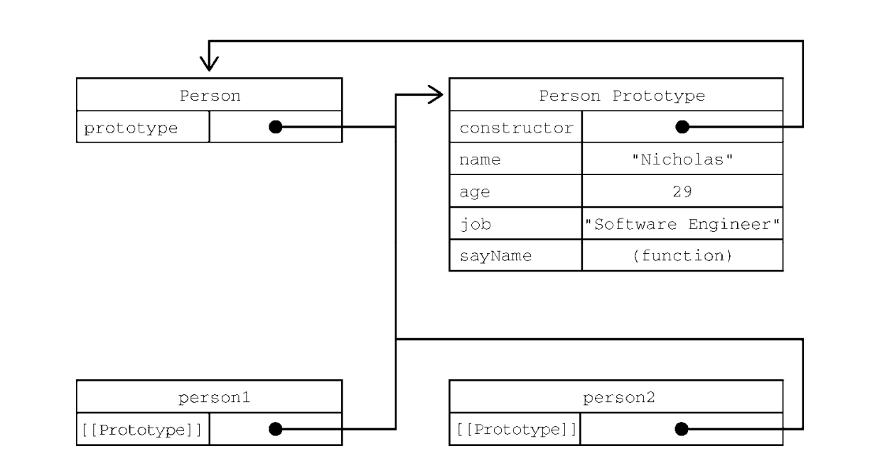
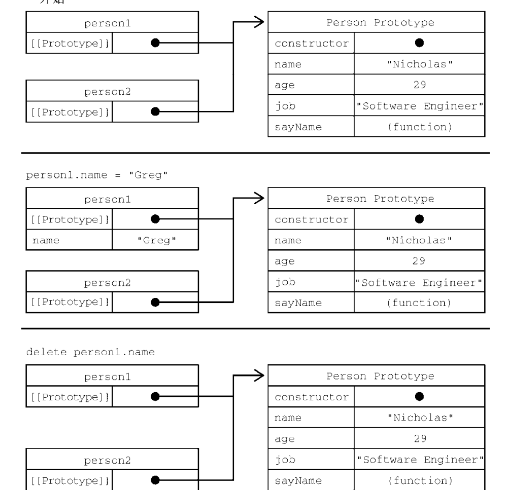
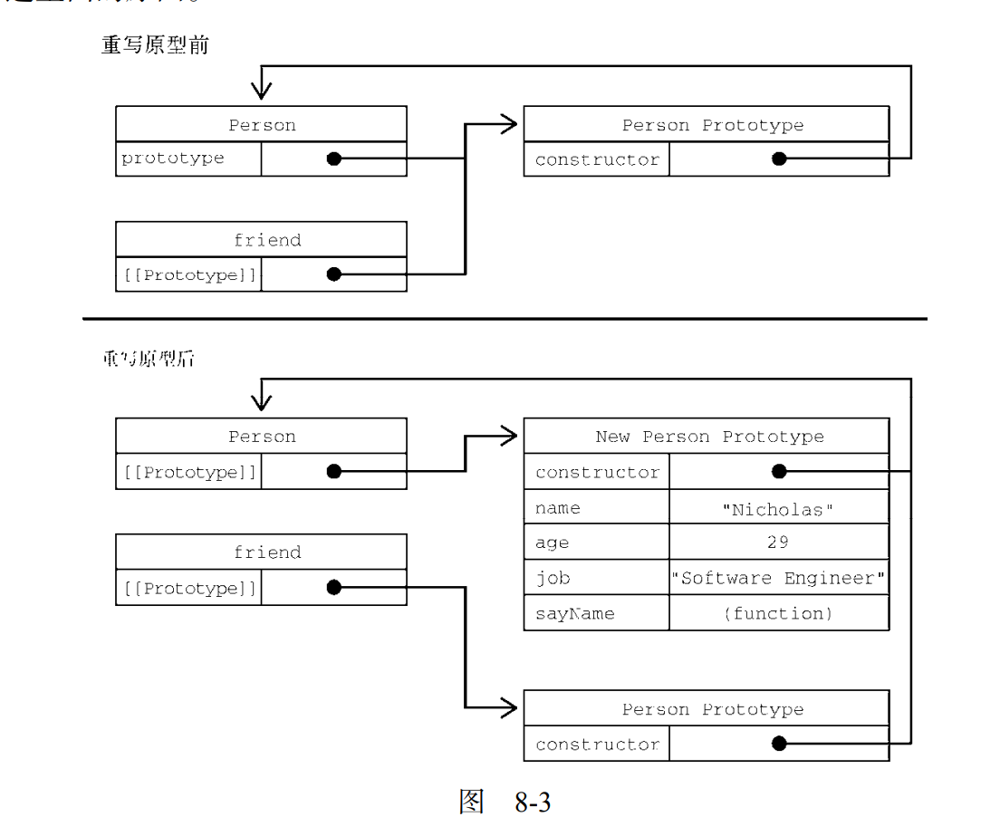
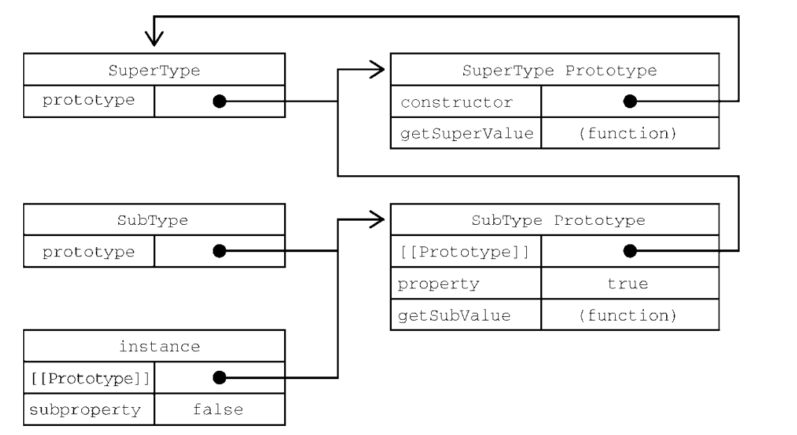
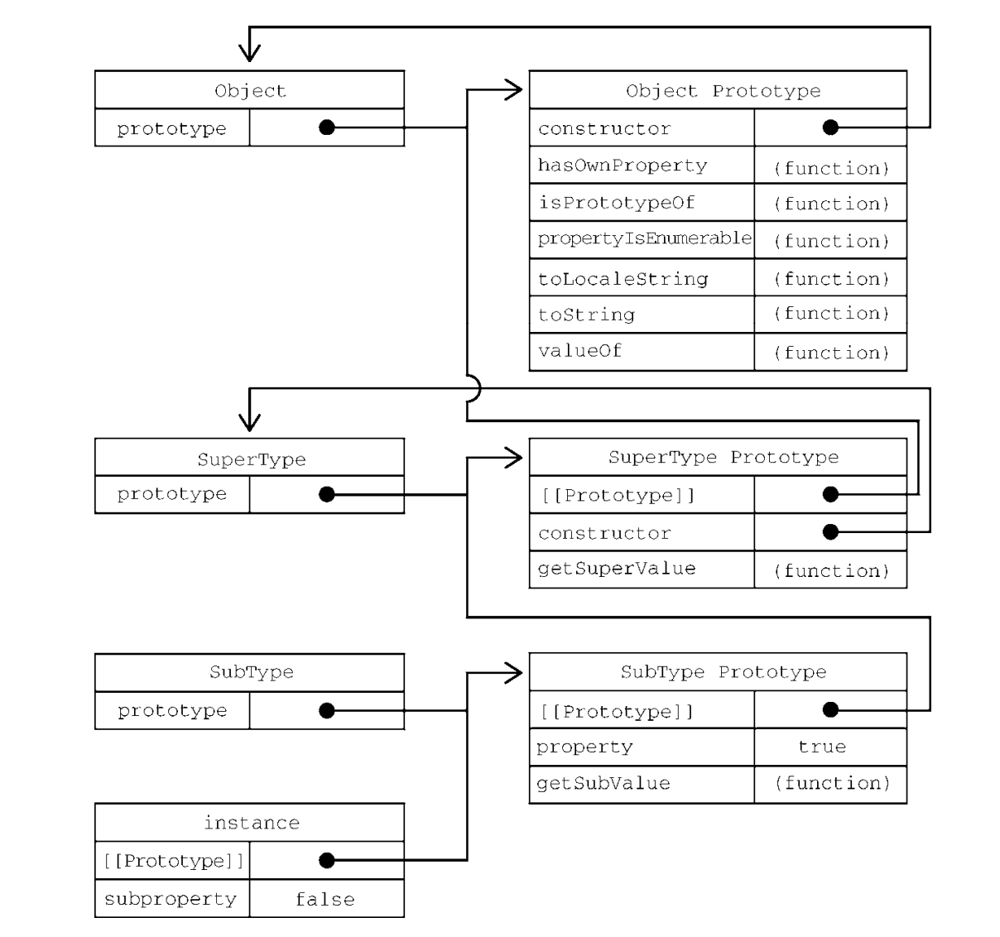
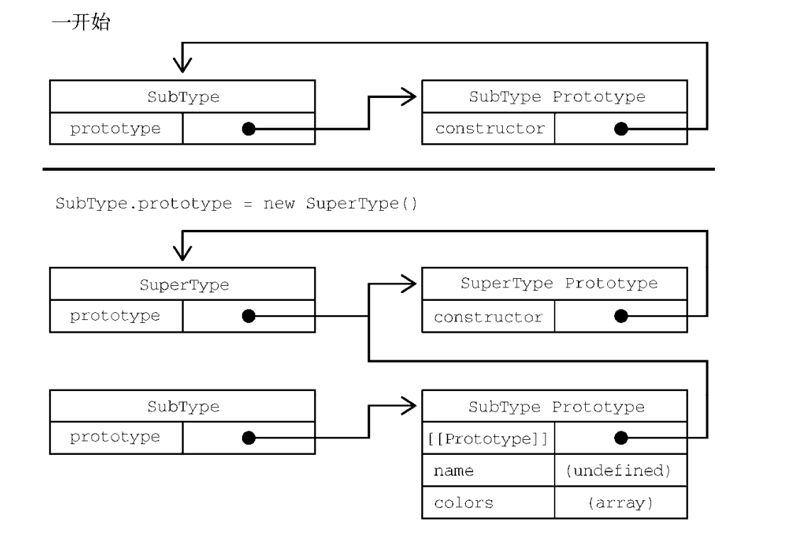
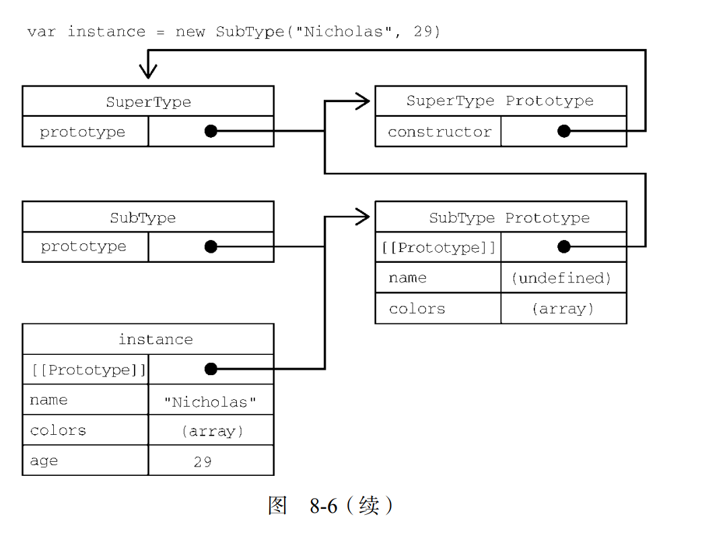

# JS中的对象、类与面向对象

ECMA-262 将对象定义为一组属性的无序集合。严格来说，这意味着对象就是一组没有特定顺序的值。对象的每个属性或方法都由一个名称来标识，这个名称映射到一个值。正因为如此（以及其他还未讨论的原因），可以把 ECMAScript 的对象想象成一张散列表，**其中的内容就是一组名/值对**，值可以是数据或者函数。

## 理解对象

创建自定义对象的通常方式是创建 Object 的一个新实例，然后再给它添加属性和方法

```js
let person = new Object(); 
person.name = "Nicholas"; 
person.age = 29; 
person.job = "Software Engineer"; 
person.sayName = function() { 
 console.log(this.name); 
}; 

// 也可以用对象字面量的方式创建它

let person = { 
 name: "Nicholas", 
 age: 29, 
 job: "Software Engineer", 
 sayName() { 
 console.log(this.name); 
 } 
};
```

### 属性的类型

ECMA-262 使用一些内部特性来描述属性的特征。这些特性是由为 JavaScript 实现引擎的规范定义的。因此，开发者不能在 JavaScript 中直接访问这些特性。为了将某个特性标识为内部特性，规范会用两个中括号把特性的名称括起来，比如```[[Enumerable]]```

- 数据属性
  
  数据属性包含一个保存数据值的位置。值会从这个位置读取，也会写入到这个位置

  - [[Configurable]]：表示属性是否可以通过 delete 删除并重新定义，是否可以修改它的特性，以及是否可以把它改为访问器属性。默认情况下，所有直接定义在对象上的属性的这个特性都是 true，如前面的例子所示。
  - [[Enumerable]]：表示属性是否可以通过 for-in 循环返回。默认情况下，所有直接定义在对象上的属性的这个特性都是 true，如前面的例子所示。
  - [[Writable]]：表示属性的值是否可以被修改。默认情况下，所有直接定义在对象上的属性的这个特性都是 true，如前面的例子所示。
  - [[Value]]：包含属性实际的值。这就是前面提到的那个读取和写入属性值的位置。这个特性的默认值为 undefined

  ```js
  let person = { 
   name: "likewei" 
  }

  // 这意味着我们创建了一个person对象，并指定其中name属性的value为likewei
  ```
  
  要修改属性的默认特性，就要使用到**Object.defineProperty(object，property，{configurable，writeable，enumerable，value})**这个方法

  - object代表要修改的对象
  - property代表要修改特性的属性
  - 第三个参数为特性的值

  ```js
  // 创建了一个名为 name 的属性并给它赋予了一个只读的值"Nicholas"。这个属性的值就不能再修改了，在非严格模式下尝试给这个属性重新赋值会被忽略。在严格模式下，尝试修改只读属性的值会抛出错误。
    let person = {}; 
    Object.defineProperty(person, "name", { 
    writable: false, 
    value: "Nicholas" 
    }); 
    console.log(person.name); // "Nicholas" 
    person.name = "Greg"; 
    console.log(person.name); // "Nicholas" 

    // 这个例子把 configurable 设置为 false，意味着这个属性不能从对象上删除。非严格模式下对这个属性调用 delete 没有效果，严格模式下会抛出错误。此外，一个属性被定义为不可配置之后，就不能再变回可配置的了
    let person = {}; 
    Object.defineProperty(person, "name", { 
    configurable: false, 
    value: "Nicholas" 
    }); 
    console.log(person.name); // "Nicholas" 
    delete person.name; 
    console.log(person.name); // "Nicholas"
    // 设置configurable为false后，再次调用 Object.defineProperty()并修改任何非 writable 属性会导致错误
    let person = {}; 
    Object.defineProperty(person, "name", { 
    configurable: false, 
    value: "Nicholas" 
    }); 
    // 抛出错误
    Object.defineProperty(person, "name", { 
    configurable: true, 
    value: "Nicholas" 
    }); 
  ```

  <span style='color:red'>在调用 Object.defineProperty()时，configurable、enumerable 和 writable 的值如果不指定，则都默认为 false。</span>

- 访问器属性
  
  访问器属性不包含数据值。他们包含一个获取函数（getter）和设置函数（setter），不过这两个函数不是必须的。在读取访问器属性时，会调用获取函数，这个函数的责任就是返回一个有效的值。再写入访问器属性时，会调用设置函数并传入新值，这个函数必须决定对数据做出什么修改。

  - [[configurable]]:表示属性是否可以通过 delete 删除并重新定义，是否可以修改它的特性，以及是否可以把它改为数据属性。默认情况下，所有直接定义在对象上的属性的这个特性都是 true。
  - [[Enumerable]]：表示属性是否可以通过 for-in 循环返回。默认情况下，所有直接定义在对象上的属性的这个特性都是 true。
  - [[Get]]：获取函数，在读取属性时调用。默认值为 undefined。
  - [[Set]]：设置函数，在写入属性时调用。默认值为 undefined。

访问器属性是不能直接定义的，必须使用 Object.defineProperty()。

```js
// 定义一个对象，包含伪私有成员 year_和公共成员 edition 
let book = { 
   year_: 2017, 
   edition: 1 
 }
 Object.defineProperty(book, "year", { 
  get() { 
    return this.year_; 
  }, 
  set(newValue) { 
    if (newValue > 2017) { 
    this.year_ = newValue; 
    this.edition += newValue - 2017; 
  } 
 } 
}); 
book.year = 2018; 
console.log(book.edition); // 2 
```

<span style='color:red'>获取函数和设置函数不一定都要定义。只定义获取函数意味着属性是只读的，尝试修改属性会被忽略。在严格模式下，尝试写入只定义了获取函数的属性会抛出错误。类似地，只有一个设置函数的属性是不能读取的，非严格模式下读取会返回 undefined，严格模式下会抛出错误。</span>

### 定义多个属性

在一个对象上同时定义多个属性的可能性是非常大的。为此，ECMAScript 提供了 Object.defineProperties()方法。这个方法可以通过多个描述符一次性定义多个属性。它接收两个参数：要为之添加或修改属性的对象和另一个描述符对象，其属性与要添加或修改的属性一一对应。

```js
  let book = {}
  Object.defineProperties(book, {
    year_: { 
      value: 2017 
    }, 
    edition: { 
      value: 1 
    }, 
    year: { 
      get() { 
        return this.year_; 
      }, 
      set(newValue) { 
        if (newValue > 2017) { 
          this.year_ = newValue; 
          this.edition += newValue - 2017; 
        } 
      } 
    } 
  });
})
```

### 读取属性的特性

使用 Object.getOwnPropertyDescriptor()方法可以取得指定属性的属性描述符。这个方法接收两个参数：属性所在的对象和要取得其描述符的属性名。返回值是一个对象，对于访问器属性包含configurable、enumerable、get 和 set 属性，对于数据属性包含 configurable、enumerable、writable 和 value 属性。

```js
  let book = {}
  Object.defineProperties(book, {
    year_: { 
      value: 2017 
    }, 
    edition: { 
      value: 1 
    }, 
    year: { 
      get() { 
        return this.year_; 
      }, 
      set(newValue) { 
        if (newValue > 2017) { 
          this.year_ = newValue; 
          this.edition += newValue - 2017; 
        } 
      } 
    } 
  });
})
let descriptor = Object.getOwnPropertyDescriptor(book, "year_"); 
console.log(descriptor.value); // 2017 
console.log(descriptor.configurable); // false 
console.log(typeof descriptor.get); // "undefined" 
let descriptor = Object.getOwnPropertyDescriptor(book, "year"); 
console.log(descriptor.value); // undefined 
console.log(descriptor.enumerable); // false 
console.log(typeof descriptor.get); // "function" 
```

ECMAScript 2017 新增了 Object.getOwnPropertyDescriptors()静态方法。这个方法实际上会在每个自有属性上调用 Object.getOwnPropertyDescriptor()并在一个新对象中返回它们。对于前面的例子，使用这个静态方法会返回如下对象

```js
let book = {}
  Object.defineProperties(book, {
    year_: { 
      value: 2017 
    }, 
    edition: { 
      value: 1 
    }, 
    year: { 
      get() { 
        return this.year_; 
      }, 
      set(newValue) { 
        if (newValue > 2017) { 
          this.year_ = newValue; 
          this.edition += newValue - 2017; 
        } 
      } 
    } 
  });
})
console.log(Object.getOwnPropertyDescriptors(book)); 
// { 
//   edition: { 
//     configurable: false, 
//     enumerable: false, 
//     value: 1, 
//     writable: false 
//   }, 
//  year: { 
//    configurable: false, 
//    enumerable: false, 
//    get: f(), 
//    set: f(newValue), 
//   }, 
//  year_: { 
//    configurable: false, 
//    enumerable: false, 
//    value: 2017, 
//    writable: false 
//    } 
// }
```

### 合并对象

JavaScript 开发者经常觉得“合并”（merge）两个对象很有用。更具体地说，就是把源对象所有的本地属性一起复制到目标对象上。有时候这种操作也被称为“混入”（mixin），因为目标对象通过混入源对象的属性得到了增强

ECMAScript 6 专门为合并对象提供了 Object.assign()方法。这个方法接收一个目标对象和一个或多个源对象作为参数，然后将每个源对象中可枚举（Object.propertyIsEnumerable()返回 true）和自有（Object.hasOwnProperty()返回 true）属性复制到目标对象。

```js
let dest, src, result; 
/** 
 * 简单复制
 */ 
dest = {}; 
src = { id: 'src' }; 
result = Object.assign(dest, src); 
// Object.assign 修改目标对象
// 也会返回修改后的目标对象
console.log(dest === result); // true 
console.log(dest !== src); // true 
console.log(result); // { id: src } 
console.log(dest); // { id: src } 
/** 
 * 多个源对象
 */ 
dest = {}; 
result = Object.assign(dest, { a: 'foo' }, { b: 'bar' }); 
console.log(result); // { a: foo, b: bar } 
/** 
 * 获取函数与设置函数
 */ 
dest = { 
 set a(val) { 
 console.log(`Invoked dest setter with param ${val}`); 
 } 
}; 
src = { 
 get a() { 
 console.log('Invoked src getter'); 
 return 'foo'; 
 } 
}; 
Object.assign(dest, src); 
// 调用 src 的获取方法
// 调用 dest 的设置方法并传入参数"foo" 
// 因为这里的设置函数不执行赋值操作
// 所以实际上并没有把值转移过来
console.log(dest); // { set a(val) {...} } 

```

Object.assign()实际上对每个源对象执行的是浅复制。如果多个源对象都有相同的属性，则使用最后一个复制的值。此外，从源对象访问器属性取得的值，比如获取函数，会作为一个静态值赋给目标对象。换句话说，**不能在两个对象间转移获取函数和设置函数**

```js
let dest, src, result; 
/** 
 * 覆盖属性
 */ 
dest = { id: 'dest' }; 
result = Object.assign(dest, { id: 'src1', a: 'foo' }, { id: 'src2', b: 'bar' }); 
// Object.assign 会覆盖重复的属性
console.log(result); // { id: src2, a: foo, b: bar } 
// 可以通过目标对象上的设置函数观察到覆盖的过程：
dest = { 
 set id(x) { 
 console.log(x); 
 } 
}; 
Object.assign(dest, { id: 'first' }, { id: 'second' }, { id: 'third' }); 
// first 
// second 
// third 
/** 
 * 对象引用
 */ 
dest = {}; 
src = { a: {} }; 
Object.assign(dest, src); 
// 浅复制意味着只会复制对象的引用
console.log(dest); // { a :{} } 
console.log(dest.a === src.a); // true 
```

如果赋值期间出错，则操作会中止并退出，同时抛出错误。Object.assign()没有“回滚”之前赋值的概念，因此它是一个尽力而为、可能只会完成部分复制的方法。

```js
let dest, src, result; 
/** 
 * 错误处理
 */ 
dest = {}; 
src = { 
 a: 'foo', 
 get b() { 
 // Object.assign()在调用这个获取函数时会抛出错误
 throw new Error(); 
 }, 
 c: 'bar' 
}; 
try { 
 Object.assign(dest, src); 
} catch(e) {} 
// Object.assign()没办法回滚已经完成的修改
// 因此在抛出错误之前，目标对象上已经完成的修改会继续存在：
console.log(dest); // { a: foo } 

```

### 对象标识及相等判定

在 ECMAScript 6 之前，有些特殊情况即使是===操作符也无能为力

```js
// 这些是===符合预期的情况
console.log(true === 1); // false 
console.log({} === {}); // false 
console.log("2" === 2); // false 
// 这些情况在不同 JavaScript 引擎中表现不同，但仍被认为相等
console.log(+0 === -0); // true 
console.log(+0 === 0); // true 
console.log(-0 === 0); // true

// 要确定 NaN 的相等性，必须使用极为讨厌的 isNaN() 
console.log(NaN === NaN); // false 
console.log(isNaN(NaN)); // true 
```

为了改善这类情况，ES6规范新增了Object.is(),这个方法与 === 很像，但同时也考虑到了上述边界情形。这个方法必须接收两个参数

```js
console.log(Object.is(true, 1)); // false 
console.log(Object.is({}, {})); // false 
console.log(Object.is("2", 2)); // false 

// 正确的 0、-0、+0 相等/不等判定
console.log(Object.is(+0, -0)); // false 
console.log(Object.is(+0, 0)); // true 
console.log(Object.is(-0, 0)); // false

// 正确的 NaN 相等判定
console.log(Object.is(NaN, NaN)); // true 
// 要检查超过两个值，递归地利用相等性传递即可：
function recursivelyCheckEqual(x, ...rest) { 
 return Object.is(x, rest[0]) && 
 (rest.length < 2 || recursivelyCheckEqual(...rest)); 
}
```

### 增强的对象语法

ECMAScript 6 为定义和操作对象新增了很多极其有用的语法糖特性。这些特性都没有改变现有引擎的行为，但极大地提升了处理对象的方便程度

1. 属性值简写

在给对象添加变量的时候，开发者经常会发现属性名和变量名是一样的:

```js
  let name = 'Matt'; 
  let person = { 
    name: name 
  }; 
  console.log(person); // { name: 'Matt' }
```

为此，简写属性名语法出现了。简写属性名只要使用变量名（不用再写冒号）就会自动被解释为同名的属性键。如果没有找到同名变量，则会抛出 ReferenceError。

```js
let name = 'likewei'
let person = { 
  name 
}; 
console.log(person); // { name: 'likewei' }

// 代码压缩程序会在不同作用域间保留属性名，以防止找不到引用。以下面的代码为例：
function makePerson(name) { 
 return { 
 name 
 }; 
} 
let person = makePerson('Matt'); 
console.log(person.name); // Matt 
```

2. 可计算属性

在引入可计算属性之前，如果想使用变量的值作为属性，那么必须先声明对象，然后使用中括号语法来添加属性。换句话说，不能在对象字面量中直接动态命名属性

```js
const nameKey = 'name'; 
const ageKey = 'age'; 
const jobKey = 'job'; 
let person = {}; 
person[nameKey] = 'Matt'; 
person[ageKey] = 27; 
person[jobKey] = 'Software engineer'; 
console.log(person); // { name: 'Matt', age: 27, job: 'Software engineer' } 
```

有了可计算属性，就可以在对象字面量中完成动态属性赋值。中括号包围的对象属性键告诉运行时将其作为 JavaScript 表达式而不是字符串来求值

```js
  const nameKey = 'name'; 
  const ageKey = 'age'; 
  const jobKey = 'job'; 
  let person = { 
    [nameKey]: 'Matt', 
    [ageKey]: 27, 
    [jobKey]: 'Software engineer' 
  }; 
  console.log(person); // { name: 'Matt', age: 27, job: 'Software engineer' } 
```

因为被当作 JavaScript 表达式求值，所以可计算属性本身可以是复杂的表达式，在实例化时再求值

```js
  const nameKey = 'name'; 
  const ageKey = 'age'; 
  const jobKey = 'job'; 
  let uniqueToken = 0; 
  function getUniqueKey(key) { 
  return `${key}_${uniqueToken++}`; 
  } 
  let person = { 
  [getUniqueKey(nameKey)]: 'Matt', 
  [getUniqueKey(ageKey)]: 27, 
  [getUniqueKey(jobKey)]: 'Software engineer' 
  }; 
  console.log(person); // { name_0: 'Matt', age_1: 27, job_2: 'Software engineer' } 
```

3. 简写方法名

在给对象定义方法时，通常都要写一个方法名、冒号，然后再引用一个匿名函数表达式

```js
let person = { 
 sayName: function(name) { 
 console.log(`My name is ${name}`); 
 } 
}; 
person.sayName('Matt'); // My name is Matt 
```

新的简写方法的语法遵循同样的模式，但开发者要放弃给函数表达式命名（不过给作为方法的函数命名通常没什么用）。相应地，这样也可以明显缩短方法声明

```js
let person = { 
 sayName(name) { 
 console.log(`My name is ${name}`); 
 } 
}; 
person.sayName('Matt'); // My name is Matt 
```

简写方法名对获取函数和设置函数也是适用的

```js
  let person = { 
  name_: '', 
  get name() { 
  return this.name_; 
  }, 
  set name(name) { 
  this.name_ = name; 
  }, 
  sayName() { 
  console.log(`My name is ${this.name_}`); 
  } 
  }; 
  person.name = 'Matt'; 
  person.sayName(); // My name is Matt
```

简写方法名与可计算属性键相互兼容

```js
const methodKey = 'sayName'; 
let person = { 
 [methodKey](name) { 
 console.log(`My name is ${name}`); 
 } 
} 
person.sayName('Matt'); // My name is Matt
```

### 对象解构

ECMAScript 6 新增了对象解构语法，可以在一条语句中使用嵌套数据实现一个或多个赋值操作。简单地说，对象解构就是使用与对象匹配的结构来实现对象属性赋值

```js
// 不使用对象解构
  let person = { 
  name: 'Matt', 
  age: 27 
  }; 
  let personName = person.name, 
      personAge = person.age; 
  console.log(personName); // Matt 
  console.log(personAge); // 27 
  let personName = person.name, 
      personAge = person.age; 
  console.log(personName); // Matt 
  console.log(personAge); // 27

// 使用对象解构

let person = { 
 name: 'Matt', 
 age: 27 
}; 
let { name: personName, age: personAge } = person; 
console.log(personName); // Matt 
console.log(personAge); // 27 
```

使用解构，可以在一个类似对象字面量的结构中，声明多个变量，同时执行多个赋值操作。如果想让变量直接使用属性的名称，那么可以使用简写语法

```js
let person = { 
 name: 'Matt', 
 age: 27 
}; 
let { name, age } = person; 
console.log(name); // Matt 
console.log(age); // 27 
```

解构赋值不一定与对象的属性匹配。赋值的时候可以忽略某些属性，而如果引用的属性不存在，则该变量的值就是 undefined

```js
  let person = { 
  name: 'Matt', 
  age: 27 
  }; 
  let { name, job } = person; 
  console.log(name); // Matt 
  console.log(job); // undefined 
```

也可以在解构赋值的同时定义默认值，这适用于前面刚提到的引用的属性不存在于源对象中的情况

```js
let person = { 
 name: 'Matt', 
 age: 27 
}; 
let { name, job='Software engineer' } = person; 
console.log(name); // Matt 
console.log(job); // Software engineer 

```

解构在内部使用函数 ToObject()（不能在运行时环境中直接访问）把源数据结构转换为对象。这意味着在对象解构的上下文中，原始值会被当成对象。这也意味着（根据 ToObject()的定义），null和 undefined 不能被解构，否则会抛出错误

```js
let { length } = 'foobar'; 
console.log(length); // 6 
let { constructor: c } = 4; 
console.log(c === Number); // true 
let { _ } = null; // TypeError 
let { _ } = undefined; // TypeError 
```

解构并不要求变量必须在解构表达式中声明。不过，如果是给事先声明的变量赋值，则赋值表达式必须包含在一对括号中

```js
  let personName, personAge; 
  let person = { 
    name: 'Matt', 
    age: 27 
  }; 
  ({name: personName, age: personAge} = person); 
  console.log(personName, personAge); // Matt, 27
```

1. 嵌套解构
   
   解构对于引用嵌套的属性或赋值目标没有限制。为此，可以通过解构来复制对象属性

  ```js
  let person = { 
    name: 'Matt', 
    age: 27, 
    job: { 
    title: 'Software engineer' 
  } 
  }; 
  let personCopy = {}; 
  ({ 
    name: personCopy.name, 
    age: personCopy.age, 
    job: personCopy.job 
  } = person); 
  // 因为一个对象的引用被赋值给 personCopy，所以修改
  // person.job 对象的属性也会影响 personCopy 
  person.job.title = 'Hacker' 
  console.log(person); 
  // { name: 'Matt', age: 27, job: { title: 'Hacker' } } 
  console.log(personCopy); 
  // { name: 'Matt', age: 27, job: { title: 'Hacker' } }
  ```

  解构赋值可以使用嵌套结构，以匹配嵌套的属性

  ```js
   let person = { 
    name: 'Matt', 
    age: 27, 
    job: { 
    title: 'Software engineer' 
  } 
  }; 
  // 声明 title 变量并将 person.job.title 的值赋给它
  let { job: { title } } = person; 
  console.log(title); // Software engineer
  ```

  在外层属性没有定义的情况下不能使用嵌套解构。无论源对象还是目标对象都一样

  ```js
  let person = { 
    job: { 
      title: 'Software engineer' 
    } 
  }; 
  let personCopy = {}; 
  // foo 在源对象上是 undefined 
  ({ 
    foo: { 
      bar: personCopy.bar 
    } 
  } = person); 
  // TypeError: Cannot destructure property 'bar' of 'undefined' or 'null'. 
  // job 在目标对象上是 undefined 
  ({ 
  job: { 
    title: personCopy.job.title 
  } 
  } = person); 
  // TypeError: Cannot set property 'title' of undefined
  ```

  2. 部分赋值
   
   需要注意的是，涉及多个属性的解构赋值是一个输出无关的顺序化操作。如果一个解构表达式涉及多个赋值，开始的赋值成功而后面的赋值出错，则整个解构赋值只会完成一部分

   ```js
   let person = { 
    name: 'Matt', 
    age: 27 
  }; 
  let personName, personBar, personAge; 
  try { 
    // person.foo 是 undefined，因此会抛出错误
    ({name: personName, foo: { bar: personBar }, age: personAge} = person); 
  } catch(e) {} 
  console.log(personName, personBar, personAge); 
  // Matt, undefined, undefined
   ```

   3. 参数上下文匹配
   
   在函数参数列表中也可以进行解构赋值。对参数的解构赋值不会影响 arguments 对象，但可以在函数签名中声明在函数体内使用局部变量

   ```js
     let person = { 
      name: 'Matt', 
      age: 27 
    }; 
    function printPerson(foo, {name, age}, bar) { 
      console.log(arguments); 
      console.log(name, age); 
    } 
    function printPerson2(foo, {name: personName, age: personAge}, bar) { 
      console.log(arguments); 
      console.log(personName, personAge); 
    } 
    printPerson('1st', person, '2nd'); 
    // ['1st', { name: 'Matt', age: 27 }, '2nd'] 
    // 'Matt', 27 
    printPerson2('1st', person, '2nd'); 
    // ['1st', { name: 'Matt', age: 27 }, '2nd'] 
    // 'Matt', 27 
   ```

## 创建对象

虽然使用 Object 构造函数或对象字面量可以方便地创建对象，但这些方式也有明显不足：创建具有同样接口的多个对象需要重复编写很多代码

### 工厂模式（本文简单介绍,后面会有文章具体介绍前端中的模式）

工厂模式用于抽象创建特定对象的过程

```js
 // 可以用不同的参数多次调用这个函数，每次都会返回包含 3 个属性和 1 个方法的对象
  function createPerson(name, age, job) { 
    let o = new Object(); 
    o.name = name; 
    o.age = age; 
    o.job = job; 
    o.sayName = function() { 
      console.log(this.name); 
    }; 
    return o; 
  } 
  let person1 = createPerson("Nicholas", 29, "Software Engineer"); 
  let person2 = createPerson("Greg", 27, "Doctor"); 
```

### 构造函数模式

ECMAScript 中的构造函数是用于创建特定类型对象的。像 Object 和 Array 这样的原生构造函数，运行时可以直接在执行环境中使用。当然也可以自定义构造函数，以函数的形式为自己的对象类型定义属性和方法。

```js
  // 同上方工厂模式作用一样
  function Person(name, age, job){ 
    this.name = name; 
    this.age = age; 
    this.job = job; 
    this.sayName = function() { 
      console.log(this.name); 
    }; 
  } 
  let person1 = new Person("Nicholas", 29, "Software Engineer"); 
  let person2 = new Person("Greg", 27, "Doctor"); 
  person1.sayName(); // Nicholas 
  person2.sayName(); // Greg 
```

跟工厂模式的区别如下：

- 没有显式的创建对象
- 属性和方法直接赋值this
- 没有return

按照惯例，构造函数名称的首字母都是要大写的，非构造函数则以小写字母开头。

#### new（八股文-使用new操作符时发生了什么）

要创建 Person 的实例，应使用 new 操作符。以这种方式调用构造函数会执行如下操作

- 在内存中创建一个新对象
- 这个新对象内部的[[Prototype]]特性被赋值为构造函数的 prototype 属性
- 构造函数内部的 this 被赋值为这个新对象（即 this 指向新对象）
- 执行构造函数内部的代码（给新对象添加属性）
- 如果构造函数返回非空对象，则返回该对象；否则，返回刚创建的新对象

上一个例子的最后，person1 和 person2 分别保存着 Person 的不同实例。这两个对象都有一个constructor 属性指向 Person，如下所示：

```js
  console.log(person1.constructor == Person); // true 
  console.log(person2.constructor == Person); // true 
```

constructor 本来是用于标识对象类型的。不过，一般认为 instanceof 操作符是确定对象类型更可靠的方式。前面例子中的每个对象都是 Object 的实例，同时也是 Person 的实例，如下面调用instanceof 操作符的结果所示

```js
  console.log(person1 instanceof Object); // true 
  console.log(person1 instanceof Person); // true 
  console.log(person2 instanceof Object); // true 
  console.log(person2 instanceof Person); // true 
```

定义自定义构造函数可以确保实例被标识为特定类型，相比于工厂模式，这是一个很大的好处。在这个例子中，person1 和 person2 之所以也被认为是 Object 的实例，是因为所有自定义对象都继承自 Object

构造函数不一定要写成函数声明的形式。赋值给变量的函数表达式也可以表示构造函数

```js
  // function Person()...
  let Person = function(name, age, job) { 
    this.name = name; 
    this.age = age; 
    this.job = job; 
    this.sayName = function() { 
      console.log(this.name); 
    }; 
  } 
  let person1 = new Person("Nicholas", 29, "Software Engineer"); 
  let person2 = new Person("Greg", 27, "Doctor"); 
  person1.sayName(); // Nicholas 
  person2.sayName(); // Greg 
  console.log(person1 instanceof Object); // true 
  console.log(person1 instanceof Person); // true 
  console.log(person2 instanceof Object); // true 
  console.log(person2 instanceof Person); // true
```

在实例化时，如果不想传参数，那么构造函数后面的括号可加可不加。只要有 new 操作符，就可以调用相应的构造函数

```js
function Person() { 
 this.name = "Jake"; 
 this.sayName = function() { 
 console.log(this.name); 
 }; 
} 
let person1 = new Person(); 
let person2 = new Person; 
person1.sayName(); // Jake 
person2.sayName(); // Jake 
console.log(person1 instanceof Object); // true 
console.log(person1 instanceof Person); // true 
console.log(person2 instanceof Object); // true 
console.log(person2 instanceof Person); // true
```

1. 构造函数也是函数

构造函数与普通函数唯一的区别就是调用方式不同。除此之外，构造函数也是函数。并没有把某个函数定义为构造函数的特殊语法。任何函数只要使用 new 操作符调用就是构造函数，而不使用 new 操作符调用的函数就是普通函数。

```js
let person = new Person("Nicholas", 29, "Software Engineer"); 
person.sayName(); // "Nicholas" 
// 作为函数调用
Person("Greg", 27, "Doctor"); // 添加到 window 对象
window.sayName(); // "Greg" 
// 在另一个对象的作用域中调用
let o = new Object(); 
Person.call(o, "Kristen", 25, "Nurse"); 
o.sayName(); // "Kristen" 
```

<span style='color:red'>在调用一个函数而没有明确设置 this 值的情况下（即没有作为对象的方法调用，或者没有使用 call()/apply()调用），this 始终指向 Global 对象（在浏览器中就是 window 对象）</span>

2. 构造函数的问题

构造函数虽然有用，但也不是没有问题。构造函数的主要问题在于，**其定义的方法会在每个实例上都创建一遍**

```js
// person1 和 person2 都有名为 sayName()的方法，但这两个方法不是同一个 Function 实例。我们知道，ECMAScript 中的函数是对象，因此每次定义函数时，都会初始化一个对象
function Person(name, age, job){ 
 this.name = name; 
 this.age = age; 
 this.job = job; 
 this.sayName = new Function("console.log(this.name)"); // 逻辑等价
}
```

每个 Person 实例都会有自己的 Function 实例用于显示 name 属性。当然了，以这种方式创建函数会带来不同的作用域链和标识符解析。但创建新 Function实例的机制是一样的。因此不同实例上的函数虽然同名却不相等

```js
  console.log(person1.sayName == person2.sayName); // false
```

因为都是做一样的事，所以没必要定义两个不同的 Function 实例。况且，this 对象可以把函数与对象的绑定推迟到运行时

要解决这个问题，可以把函数定义转移到构造函数外部

```js
  function Person(name, age, job){ 
    this.name = name; 
    this.age = age; 
    this.job = job; 
    this.sayName = sayName; 
  } 
  function sayName() { 
    console.log(this.name); 
  } 
  let person1 = new Person("Nicholas", 29, "Software Engineer"); 
  let person2 = new Person("Greg", 27, "Doctor"); 
  person1.sayName(); // Nicholas 
  person2.sayName(); // Greg 
```

在这里，sayName()被定义在了构造函数外部。在构造函数内部，sayName 属性等于全局 sayName()函数。因为这一次 sayName 属性中包含的只是一个指向外部函数的指针，所以 person1 和 person2共享了定义在全局作用域上的 sayName()函数。这样虽然解决了相同逻辑的函数重复定义的问题，但全局作用域也因此被搞乱了，因为那个函数实际上只能在一个对象上调用。如果这个对象需要多个方法，那么就要在全局作用域中定义多个函数。这会导致自定义类型引用的代码不能很好地聚集一起。这个新问题可以通过原型模式来解决。

### 原型模式

每个函数都会创建一个prototype属性，这个属性是一个对象，包含应该由特定引用类型的实例共享的属性和方法。

实际上，这个对象就是通过调用构造函数创建的对象的原型

使用原型对象的好处是，在它上面定义的属性和方法可以被对象实例共享。原来在构造函数中直接赋给对象实例的值，可以直接赋值给它们的原型

```js
  function Person() {} 
    Person.prototype.name = "Nicholas"; 
    Person.prototype.age = 29; 
    Person.prototype.job = "Software Engineer"; 
    Person.prototype.sayName = function() { 
      console.log(this.name); 
    }; 
  let person1 = new Person(); 
  person1.sayName(); // "Nicholas" 
  let person2 = new Person(); 
  person2.sayName(); // "Nicholas" 
  console.log(person1.sayName == person2.sayName); // true 

  // 使用函数表达式也可以
  let Person = function() {}; 
    Person.prototype.name = "Nicholas"; 
    Person.prototype.age = 29; 
    Person.prototype.job = "Software Engineer"; 
    Person.prototype.sayName = function() { 
      console.log(this.name); 
    }; 
  let person1 = new Person(); 
  person1.sayName(); // "Nicholas" 
  let person2 = new Person(); 
  person2.sayName(); // "Nicholas" 
  console.log(person1.sayName == person2.sayName); // true
```

这里，所有属性和 sayName()方法都直接添加到了 Person 的 prototype 属性上，构造函数体中什么也没有。但这样定义之后，调用构造函数创建的新对象仍然拥有相应的属性和方法。与构造函数模式不同，使用这种原型模式定义的属性和方法是由所有实例共享的。因此 person1 和 person2 访问的都是相同的属性和相同的 sayName()函数

#### 原型的本质(八股文)

1. 理解原型（原型链）

无论何时，只要创建一个函数，就会按照特定的规则为这个函数创建一个 prototype 属性（指向原型对象）。默认情况下，所有原型对象自动获得一个名为 constructor 的属性，指回与之关联的构造函数。

就前面例子而言，Person.prototype.constructor指向Person。然后，因构造函数而异，可能会给原型对象添加其他属性和方法

  在自定义构造函数时：
  1. 原型对象默认只会获得constructor属性，其他的所有方法都继承自Object
  2. 每次调用这个构造函数创建实例，实例内部的[[Prototype]]指针就会被赋值为构造函数的原型对象（prototype）
  
  <span style='color:red'>没有直接访问[[prototype]]的方式，但是Chrome、Firefox、Safari暴露了__proto__属性，可以通过这个属性访问对象的原型</span>

  下面代码能更好理解原型的行为:

  ```js
  /** 
   * 构造函数可以是函数表达式
   * 也可以是函数声明，因此以下两种形式都可以：
   * function Person() {} 
   * let Person = function() {} 
   */ 
   function Person() {}


   /** 
    * 声明之后，构造函数就有了一个
    * 与之关联的原型对象：
    */ 
    console.log(typeof Person.prototype);  // object
    console.log(Person.prototype); 
    // { 
    // constructor: f Person(), 
    // __proto__: Object 
    // }


    /** 
    * 如前所述，构造函数有一个 prototype 属性
    * 引用其原型对象，而这个原型对象也有一个
    * constructor 属性，引用这个构造函数
    * 换句话说，两者循环引用：
    */ 
    console.log(Person.prototype.constructor === Person); // true


    /** 
    * 正常的原型链都会终止于 Object 的原型对象
    * Object 原型的原型是 null 
    */ 
    console.log(Person.prototype.__proto__ === Object.prototype); // true 
    console.log(Person.prototype.__proto__.constructor === Object); // true 
    console.log(Person.prototype.__proto__.__proto__ === null); // true
    console.log(Person.prototype.__proto__); 
    // { 
    // constructor: f Object(), 
    // toString: ... 
    // hasOwnProperty: ... 
    // isPrototypeOf: ... 
    // ... 
    // } 

    let person1 = new Person(), 
    person2 = new Person();
    
    /** 
    * 构造函数、原型对象和实例
    * 是 3 个完全不同的对象：
    */ 
    console.log(person1 !== Person); // true 
    console.log(person1 !== Person.prototype); // true 
    console.log(Person.prototype !== Person); // true 
  
  /** 
  * 实例通过__proto__链接到原型对象，
  * 它实际上指向隐藏特性[[Prototype]] 
  * 
  * 构造函数通过 prototype 属性链接到原型对象
  * 
  * 实例与构造函数没有直接联系，与原型对象有直接联系
  */ 
  console.log(person1.__proto__ === Person.prototype); // true 
  conosle.log(person1.__proto__.constructor === Person); // true 
  
  /** 
  * 同一个构造函数创建的两个实例
  * 共享同一个原型对象：
  */ 
  console.log(person1.__proto__ === person2.__proto__); // true 

  /** 
   * instanceof 检查实例的原型链中
   * 是否包含指定构造函数的原型：
   */ 
   console.log(person1 instanceof Person); // true 
   console.log(person1 instanceof Object); // true 
   console.log(Person.prototype instanceof Object); // true
  ```

  用下面的图就能很好的理解原型及[这段代码](#原型模式)

  

  1. <span style='color:red'>Person.prototype 指向原型对象，而 Person.prototype.contructor 指回 Person 构造函数</span>
  2. 原型对象包含 constructor 属性和其他后来添加的属性
  3. Person 的两个实例 person1 和 person2 都只有一个内部属性指回 Person.prototype，**而且两者都与构造函数没有直接联系**
  4. 虽然不是所有实现都对外暴露了[[Prototype]]，但可以使用 isPrototypeOf()方法确定两个对象之间的这种关系

```js
  // 这里通过原型对象调用 isPrototypeOf()方法检查了 person1 和 person2
  console.log(Person.prototype.isPrototypeOf(person1)); // true 
  console.log(Person.prototype.isPrototypeOf(person2)); // true
```

ECMAScript 的 Object 类型有一个方法叫 Object.getPrototypeOf()，返回参数的内部特性[[Prototype]]的值

```js
  console.log(Object.getPrototypeOf(person1) == Person.prototype); // true 
  console.log(Object.getPrototypeOf(person1).name); // "Nicholas" 
```

Object 类型还有一个 setPrototypeOf()方法，可以向实例的私有特性[[Prototype]]写入一个新值。这样就可以重写一个对象的原型继承关系

<span style='color:red'>这种方法十分影响性能</span>
```js
    let biped = { 
      numLegs: 2 
    }; 
    let person = { 
      name: 'Matt' 
    }; 
    Object.setPrototypeOf(person, biped); 
    console.log(person.name); // Matt 
    console.log(person.numLegs); // 2 
    console.log(Object.getPrototypeOf(person) === biped); // true 
```

为避免使用 Object.setPrototypeOf()可能造成的性能下降，可以通过 [Object.create()](https://developer.mozilla.org/zh-CN/docs/Web/JavaScript/Reference/Global_Objects/Object/create)来创建一个新对象，同时为其指定原型

```js
  let biped = { 
    numLegs: 2 
  }; 
  let person = Object.create(biped); 
  person.name = 'Matt'; 
  console.log(person.name); // Matt 
  console.log(person.numLegs); // 2 
  console.log(Object.getPrototypeOf(person) === biped); // true
```

2. 原型层级

在通过对象访问属性时，会按照这个属性的名称开始搜索：

- 搜索开始于对象实例本身： 如果在这个实例上发现了给定的名称，则返回该名称对应的值
- 如果没有找到这个属性，则搜索会沿着指针进入原型对象（[[prototype]]），然后在原型对象上找到属性后，再返回对应的值

因此调用person1.sayName()时，会发生以下情况(原型用于在多个对象实例间共享属性和方法的原理)：

1. 首先，JS引擎会问 “person1 实例有 sayName 属性吗？” 答案是没有
2. 然后继续搜索并问 “person1 的原型有 sayName 属性吗？” 答案是有。于是就返回了保存在原型上的这个函数

虽然可以通过实例读取原型对象上的值，但不可能通过实例重写这些值。如果在实例上添加了一个与原型对象中同名的属性，那就会在实例上创建这个属性，这个属性会遮住原型对象上的属性。

```js
  function Person() {} 
    Person.prototype.name = "Nicholas"; 
    Person.prototype.age = 29; 
    Person.prototype.job = "Software Engineer"; 
    Person.prototype.sayName = function() { 
    console.log(this.name); 
  }; 
  let person1 = new Person(); 
  let person2 = new Person(); 
  person1.name = "Greg"; 
  console.log(person1.name); // "Greg"，来自实例
  console.log(person2.name); // "Nicholas"，来自原型

  // 只要给对象实例添加一个属性，这个属性就会遮蔽（shadow）原型对象上的同名属性
  // 即使在实例上把这个属性设置为 null，也不会恢复它和原型的联系
  // 使用 delete 操作符可以完全删除实例上的这个属性，从而让标识符解析过程能够继续搜索原型对象

  function Person() {} 
    Person.prototype.name = "Nicholas"; 
    Person.prototype.age = 29; 
    Person.prototype.job = "Software Engineer"; 
    Person.prototype.sayName = function() { 
    console.log(this.name); 
  }; 
  let person1 = new Person(); 
  let person2 = new Person(); 
  person1.name = "Greg"; 
  console.log(person1.name); // "Greg"，来自实例
  console.log(person2.name); // "Nicholas"，来自原型
  delete person1.name; 
  console.log(person1.name); // "Nicholas"，来自原型
```

- hasOwnProperty()

用于确定某个属性是在实例上还是在原型对象上,这个方法继承自Object，属性存在实例上时返回true

```js
function Person() {} 
Person.prototype.name = "Nicholas";
Person.prototype.age = 29; 
Person.prototype.job = "Software Engineer"; 
Person.prototype.sayName = function() { 
 console.log(this.name); 
}; 
let person1 = new Person(); 
let person2 = new Person(); 
console.log(person1.hasOwnProperty("name")); // false 
person1.name = "Greg"; 
console.log(person1.name); // "Greg"，来自实例
console.log(person1.hasOwnProperty("name")); // true 
console.log(person2.name); // "Nicholas"，来自原型
console.log(person2.hasOwnProperty("name")); // false 
delete person1.name; 
console.log(person1.name); // "Nicholas"，来自原型
console.log(person1.hasOwnProperty("name")); // false 
```



3. 原型和in操作符

有两种方式使用 in 操作符：

- 单独使用
  
  in 操作符会在可以通过对象访问指定属性时返回 true(不管实例还是原型)

  ```js
  function Person() {} 
  Person.prototype.name = "Nicholas"; 
  Person.prototype.age = 29; 
  Person.prototype.job = "Software Engineer"; 
  Person.prototype.sayName = function() { 
    console.log(this.name); 
  }; 
  let person1 = new Person(); 
  let person2 = new Person(); 
  console.log(person1.hasOwnProperty("name")); // false 
  console.log("name" in person1); // true 
  person1.name = "Greg"; 
  console.log(person1.name); // "Greg"，来自实例
  console.log(person1.hasOwnProperty("name")); // true 
  console.log("name" in person1); // true 
  console.log(person2.name); // "Nicholas"，来自原型
  console.log(person2.hasOwnProperty("name")); // false 
  console.log("name" in person2); // true 
  delete person1.name; 
  console.log(person1.name); // "Nicholas"，来自原型
  console.log(person1.hasOwnProperty("name")); // false 
  console.log("name" in person1); // true 
  ```

<span style='color: red'>如果要确定某个属性是否存在于原型上，则可以像下面这样同时使用 hasOwnProperty()和 in 操作符</span>

```js
function hasPrototypeProperty(object, name){ 
 return !object.hasOwnProperty(name) && (name in object); 
}
```

只要通过对象可以访问，in 操作符就返回 true，而 hasOwnProperty()只有属性存在于实例上时才返回 true。因此，只要 in 操作符返回 true 且 hasOwnProperty()返回 false，就说明该属性是一个原型属性

```js
function Person() {} 
Person.prototype.name = "Nicholas"; 
Person.prototype.age = 29; 
Person.prototype.job = "Software Engineer";
Person.prototype.sayName = function() { 
 console.log(this.name); 
}; 
let person = new Person(); 
console.log(hasPrototypeProperty(person, "name")); // true 
person.name = "Greg"; 
console.log(hasPrototypeProperty(person, "name")); // false 
```

- for-in 循环中使用。

    可以通过对象访问且可以被枚举的属性都会返回，包括实例属性和原型属性。遮蔽原型中不可枚举（[[Enumerable]]特性被设置为 false）属性的实例属性也会在 for-in 循环中返回
  
    - Object.keys()
        
        获得对象上所有可枚举的实例属性

      
        ```js
          function Person() {} 
          Person.prototype.name = "Nicholas"; 
          Person.prototype.age = 29; 
          Person.prototype.job = "Software Engineer"; 
          Person.prototype.sayName = function() { 
            console.log(this.name); 
          }; 
          let keys = Object.keys(Person.prototype); 
          console.log(keys); // "name,age,job,sayName" 
          let p1 = new Person(); 
          p1.name = "Rob"; 
          p1.age = 31; 
          let p1keys = Object.keys(p1); 
          console.log(p1keys); // "[name,age]" 
        ```
  
  如果想列出所有实例属性，无论是否可以枚举，都可以使用 Object.getOwnPropertyNames()

  ```js
    let keys = Object.getOwnPropertyNames(Person.prototype); 
    console.log(keys); // "[constructor,name,age,job,sayName]" 
    // 注意，返回的结果中包含了一个不可枚举的属性 constructor。
  ```

  Object.keys()和 Object. getOwnPropertyNames()在适当的时候都可用来代替 for-in 循环。

  在 ECMAScript 6 新增符号类型之后，相应地出现了增加一个 Object.getOwnPropertyNames()的兄弟方法的需求，因为以符号为键的属性没有名称的概念。因此，Object.getOwnPropertySymbols()方法就出现了，这个方法与 Object.getOwnPropertyNames()类似，只是针对符号而已：

  ```js
  let k1 = Symbol('k1'), 
      k2 = Symbol('k2'); 
  let o = { 
    [k1]: 'k1', 
    [k2]: 'k2' 
  }; 
  console.log(Object.getOwnPropertySymbols(o)); 
  // [Symbol(k1), Symbol(k2)] 
  ```

  4. 属性枚举顺序
   
  for-in 循环、Object.keys()、Object.getOwnPropertyNames()、Object.getOwnPropertySymbols()以及 Object.assign()在属性枚举顺序方面有很大区别

  <span style='color:red'>for-in 循环和 Object.keys()的枚举顺序是不确定的，取决于 JavaScript 引擎，可能因浏览器而异。</span>

  Object.getOwnPropertyNames()、Object.getOwnPropertySymbols()和 Object.assign()的枚举顺序是确定性的。

  ```js
   // 先以升序枚举数值键，然后以插入顺序枚举字符串和符号键。在对象字面量中定义的键以它们逗号分隔的顺序插入。
   
   let k1 = Symbol('k1'), 
       k2 = Symbol('k2'); 
  let o = { 
      1: 1, 
      first: 'first', 
      [k1]: 'sym2', 
      second: 'second', 
      0: 0 
  }; 
  o[k2] = 'sym2'; 
  o[3] = 3; 
  o.third = 'third'; 
  o[2] = 2; 
  console.log(Object.getOwnPropertyNames(o)); 
  // ["0", "1", "2", "3", "first", "second", "third"] 
  console.log(Object.getOwnPropertySymbols(o)); 
  // [Symbol(k1), Symbol(k2)] 

  ```

### 对象迭代（循环）

ES7增加了两个方法用于迭代对象

- Object.values()：返回对象值的数组。
  
- Object.entries()：返回键/值对的数组。

  ```js
  const o = { 
    foo: 'bar', 
    baz: 1, 
    qux: {} 
  }; 
  console.log(Object.values(o));
  // ["bar", 1, {}]
  console.log(Object.entries((o))); 
  // [["foo", "bar"], ["baz", 1], ["qux", {}]] 
  ```

  <span style='color:red'>非字符串属性会被转换为字符串输出。另外，这两个方法执行对象的浅复制</span>

  ```js
    const o = { 
      qux: {} 
    }; 
    console.log(Object.values(o)[0] === o.qux); 
    // true 
    console.log(Object.entries(o)[0][1] === o.qux); 
    // true
  ```

  符号属性会被忽略

  ```js
  const sym = Symbol(); 
  const o = { 
    [sym]: 'foo' 
  }; 
  console.log(Object.values(o)); 
  // [] 
  console.log(Object.entries((o))); 
  // []
  ```

  1. 其他原型语法（原型字面量）
   
   直接通过一个包含所有属性和方法的对象字面量来重写原型成为了一种常见的做法

```js
    function Person() {} 
    Person.prototype = {
      name: "Nicholas", 
      age: 29, 
      job: "Software Engineer", 
      sayName() { 
        console.log(this.name); 
      } 
    };
    // 这样重写以后，Person.constructor不再指向Person而是Object， 如果constructor很重要，可以专门设置constructor

    function Person() {} 
    Person.prototype = {
      // 这里的constructor的[[Enumberable]]默认为true，如果需要设置为false则设置为Object.defineProperty方法来定义constructor
      constructor: Person, 
      name: "Nicholas", 
      age: 29, 
      job: "Software Engineer", 
      sayName() { 
        console.log(this.name); 
      } 
    }; 
```

2. 原型的动态性

因为从原型上搜索值的过程是动态的，所以即使实例在修改原型之前已经存在，任何时候对原型对象所做的修改也会在实例上反映出来

```js
  let friend = new Person(); 
  Person.prototype.sayHi = function() { 
    console.log("hi"); 
  }; 
  friend.sayHi(); // "hi"，没问题
```

虽然随时能给原型添加属性和方法，并能够立即反映在所有对象实例上，但这跟重写整个原型是两回事。实例的[[Prototype]]指针是在调用构造函数时自动赋值的，这个指针即使把**原型修改为不同的对象也不会变**。

```js
    function Person() {} 
    let friend = new Person(); 
    Person.prototype = { 
      constructor: Person, 
      name: "Nicholas", 
      age: 29, 
      job: "Software Engineer", 
      sayName() { 
        console.log(this.name); 
      } 
    }; 
    friend.sayName(); // 错误
```



3. 原生对象原型

原型模式之所以重要，不仅体现在自定义类型上，而且还因为它也是实现所有原生引用类型的模式。所有原生引用类型的构造函数（包括 Object、Array、String 等）都在原型上定义了实例方法

```js
  // 数组实例的 sort()方法就是 Array.prototype 上定义的，而字符串包装对象的 substring()方法也是在 String.prototype 上定义的
  console.log(typeof Array.prototype.sort); // "function" 
  console.log(typeof String.prototype.substring); // "function"
```

通过原生对象的原型可以取得所有默认方法的引用，也可以给原生类型的实例定义新的方法。可以像修改自定义对象原型一样修改原生对象原型，因此随时可以添加方法。

```js
// 给 String原始值包装类型的实例添加了一个 startsWith()方法
String.prototype.startsWith = function (text) { 
 return this.indexOf(text) === 0; 
}; 
let msg = "Hello world!"; 
console.log(msg.startsWith("Hello")); // true
```

>>>尽管可以这么做，但并不推荐在产品环境中修改原生对象原型。这样做很可能造成误会，而且可能引发命名冲突（比如一个名称在某个浏览器实现中不存在，在另一个实现中却存在）。另外还有可能意外重写原生的方法。推荐的做法是创建一个自定义的类，继承原生类型

4. 原型的问题

原型模式也不是没有问题

- 弱化了向构造函数传递初始化参数的能力，会导致所有实例默认都取得相同的属性值
- 共享特性

  原型上的所有属性是在实例间共享的，这对函数来说比较合适

  ```js
  // 污染了共享属性
  function Person() {} 
  Person.prototype = { 
    constructor: Person, 
    name: "Nicholas", 
    age: 29, 
    job: "Software Engineer", 
    friends: ["Shelby", "Court"], 
    sayName() { 
      console.log(this.name); 
    } 
  }; 
  let person1 = new Person(); 
  let person2 = new Person(); 
  person1.friends.push("Van"); 
  console.log(person1.friends); // "Shelby,Court,Van" 
  console.log(person2.friends); // "Shelby,Court,Van" 
  console.log(person1.friends === person2.friends); // true
  ```

## 继承

大多数面向对象编程语言都支持两种继承方式：接口继承（继承方法签名）、实现继承（继承实际的方法）。

接口继承在 ECMAScript 中是不可能的，因为函数没有签名

**实现继承是 ECMAScript 唯一支持的继承方式，而这主要是通过原型链实现的。**

### 原型链

原型链是ECMA-262种主要的继承方式。其基本思想就是通过原型继承多个引用类型的属性和方法。

构造函数、原型和实例间的关系：

每个构造函数都有一个原型对象Prototype

构造函数的Prototype中的constructor指向构造函数

实例的[[prototype]]（__proto__）指向构造函数的原型对象（即构造函数.Prototype）

如果原型是另一个类型的实例，意味着这个原型本身有一个内部指针指向另一个原型，相应地另一个原型也有一个指针指向另一个构造函数。这样就在实例和原型之间构造了一条**原型链**

```js
// 实现原型链
function SuperType() { 
 this.property = true; 
} 
SuperType.prototype.getSuperValue = function() { 
 return this.property; 
}; 
function SubType() { 
 this.subproperty = false; 
} 
// 继承 SuperType 
SubType.prototype = new SuperType(); 
SubType.prototype.getSubValue = function () {
  return this.subproperty; 
}; 
let instance = new SubType(); 
console.log(instance.getSuperValue()); // true
```

上面的代码定义了两个类型：SuperType 和 SubType。这两个类型分别定义了一个属性和一个方法。

这两个类型的主要区别是：SubType通过创建SuperType的实例并将其赋值给自己的原型SubType.prototype实现了对SuperType的继承

这意味着superType实例可以访问的所有属性和方法也会存在于SubType.prototype



实现继承的关键是：

subType没有使用默认的原型，而是将其替换成了一个新的对象（superType的实例）

所以subType的实例不仅能从SuperType的实例中继承属性和方法，还和SuperType的原型挂上了钩

**即 subtype实例 -->(__proto__) Subtype.prototype -->(__proto__) SuperType.prototype**

原型链扩展了原型搜索机制。在读取实例上的属性时：

- 首先在实例上搜索，找到就返回
- 如果没找到，就在实例的原型上寻找
- 实现原型链继承以后就会继承向上，搜索原型的原型

如上面的例子调用instace.getSuperValue()经过了3步: instace、SubType.prototype、SuperType.prototype(SubType.prototype.__proto__)

1. 默认原型

默认情况下，所有引用类型都继承自Object,这也是通过原型链实现的。任何函数的默认原型都是一个Object实例，这意味着这个实例内部有一个指针指向Object.prototype

所以这才是完整的原型链：



SubType 继承 SuperType，而 SuperType 继承 Object。在调用 instance.toString()时，实际上调用的是保存在 Object.prototype 上的方法。

2. 原型与继承的关系

原型与实例的关系可以通过两种方式来确定。

- instanceof操作符

  如果一个实例的原型链中出现过相应的构造函数，则instaceof返回true

  ```js
    //instance 是 Object、SuperType 和 SubType 的实例，因为 instance 的原型链中包含这些构造函数的原型。结果就是 instanceof 对所有这些构造函数都返回 true
    console.log(instance instanceof Object); // true 
    console.log(instance instanceof SuperType); // true 
    console.log(instance instanceof SubType); // true`
  ```

- isPrototypeof()方法

原型链中的每个原型都可以调用这个方法，只要原型链中包含这个原型，就返回true

```js
  console.log(Object.prototype.isPrototypeOf(instance)); // true 
  console.log(SuperType.prototype.isPrototypeOf(instance)); // true 
  console.log(SubType.prototype.isPrototypeOf(instance)); // true
```

3. 关于方法

子类有时候要覆盖父类，或者增加父类没有的方法。这些方法必须在原型赋值以后再添加到原型上

```js
function SuperType() { 
 this.property = true; 
} 
SuperType.prototype.getSuperValue = function() { 
 return this.property; 
}; 
function SubType() { 
 this.subproperty = false; 
} 
// 继承 SuperType 
SubType.prototype = new SuperType(); 
// 新方法
SubType.prototype.getSubValue = function () { 
 return this.subproperty; 
}; 
// 覆盖已有的方法
SubType.prototype.getSuperValue = function () { 
 return false; 
}; 
let instance = new SubType(); 
console.log(instance.getSuperValue()); // false 
```

以对象字面量方式创建原型方法会破坏之前的原型链，因为相当于重写了原型链

```js
function SuperType() { 
 this.property = true; 
} 
SuperType.prototype.getSuperValue = function() { 
 return this.property; 
}; 
function SubType() { 
 this.subproperty = false;
}
// 继承 SuperType 
SubType.prototype = new SuperType(); 
// 通过对象字面量添加新方法，这会导致上一行无效
// 覆盖后的原型是一个 Object 的实例，而不再是 SuperType 的实例。因此之前的原型链就断了
SubType.prototype = { 
 getSubValue() { 
 return this.subproperty; 
 }, 
 someOtherMethod() { 
 return false; 
 } 
}; 
let instance = new SubType(); 
console.log(instance.getSuperValue()); // 出错！
```

#### 原型链的问题


- 问题一：原型中包含引用值时会在所有实例间共享

```js
function SuperType() { 
 this.colors = ["red", "blue", "green"]; 
} 
function SubType() {} 
// 继承 SuperType 
SubType.prototype = new SuperType(); 
let instance1 = new SubType(); 
instance1.colors.push("black"); 
console.log(instance1.colors); // "red,blue,green,black" 
let instance2 = new SubType(); 
console.log(instance2.colors); // "red,blue,green,black"
```

- 问题二：子类型在实例化时不能给父类型的构造函数传参

### 盗用构造函数

  为了解决原型包含引用值导致的继承问题，盗用构造函数（对象伪装、经典继承）开始流行。

  基本思路是： 在子类构造函数中调用父类构造函数

  因为函数就是在特定上下文中执行代码的简单对象，所以可以使用apply()或call()方法以新创建的对象为上下文执行构造函数

  ```js
    function SuperType() { 
    this.colors = ["red", "blue", "green"]; 
    } 
    function SubType() { 
    // 继承 SuperType 
    SuperType.call(this); 
    } 
    let instance1 = new SubType(); 
    instance1.colors.push("black"); 
    console.log(instance1.colors); // "red,blue,green,black" 
    let instance2 = new SubType(); 
    console.log(instance2.colors); // "red,blue,green" 
  ```
  #### 优点

  - 传递参数
  
   相比于使用原型链，盗用构造函数的一个优点就是可以在子类构造函数中向父类构造函数传参

   ```js
   function SuperType(name){ 
     this.name = name; 
    } 
    function SubType() { 
      // 继承 SuperType 并传参
      SuperType.call(this, "Nicholas"); 
      // 实例属性
      this.age = 29; 
    } 
    let instance = new SubType(); 
    console.log(instance.name); // "Nicholas"; 
    console.log(instance.age); // 29 
   ```

   #### 盗用构造函数的问题

   - 也是构造函数的问题：必须在构造函数中定义方法，因此函数不能重用。
   - 子类不能访问父类定义的方法

### 组合继承

组合继承（有时候也叫伪经典继承）综合了原型链和盗用构造函数，将两者的优点集中了起来。

基本思路是： 使用原型链继承原型上的属性和方法，而通过盗用构造函数继承实例属性

组合继承弥补了原型链和盗用构造函数的不足，是 JavaScript 中使用最多的继承模式。而且组合继承也保留了 instanceof 操作符和 isPrototypeOf()方法识别合成对象的能力

```js
 // 
    function SuperType(name){ 
    this.name = name; 
    this.colors = ["red", "blue", "green"]; 
    } 
    SuperType.prototype.sayName = function() { 
    console.log(this.name); 
    }; 
    function SubType(name, age){ 
      // 继承属性
      SuperType.call(this, name); 
      this.age = age; 
    } 
    // 继承方法
    SubType.prototype = new SuperType(); 
    SubType.prototype.sayAge = function() { 
    console.log(this.age); 
    }; 
    let instance1 = new SubType("Nicholas", 29); 
    instance1.colors.push("black"); 
    console.log(instance1.colors); // "red,blue,green,black" 
    instance1.sayName(); // "Nicholas"; 
    instance1.sayAge(); // 29 
    let instance2 = new SubType("Greg", 27); 
    console.log(instance2.colors); // "red,blue,green" 
    instance2.sayName(); // "Greg"; 
    instance2.sayAge(); // 27 
```

### 原型式继承

```js
  function object(o) { 
    function F() {} 
    F.prototype = o; 
    return new F(); 
  }
```

这个object()函数会创建一个临时构造函数，将传入的对象赋值给这个构造函数的原型，然后返回这个临时类型的一个实例。本质上，object()是对传入的对象执行了一次浅复制(也存在原型链继承模式的问题)。

```js
  let person = { 
    name: "Nicholas", 
    friends: ["Shelby", "Court", "Van"] 
  }; 
  let anotherPerson = object(person); 
  anotherPerson.name = "Greg"; 
  anotherPerson.friends.push("Rob"); 
  let yetAnotherPerson = object(person); 
  yetAnotherPerson.name = "Linda"; 
  yetAnotherPerson.friends.push("Barbie"); 
  console.log(person.friends); // "Shelby,Court,Van,Rob,Barbie"
``` 

#### 适用场景

有一个对象，想在它的基础上再创建一个新对象。

#### ES5 Object.create(proto, propertiesObject？)

只有一个参数时,Object.create()与我们定义的object()效果相同

```js
let person = { 
 name: "Nicholas", 
 friends: ["Shelby", "Court", "Van"] 
}; 
let anotherPerson = Object.create(person); 
anotherPerson.name = "Greg"; 
anotherPerson.friends.push("Rob"); 
let yetAnotherPerson = Object.create(person); 
yetAnotherPerson.name = "Linda"; 
yetAnotherPerson.friends.push("Barbie"); 
console.log(person.friends); // "Shelby,Court,Van,Rob,Barbie"
```

Object.create()的第二个参数是可选的，与Object.definedproperties()的第二个属性相同（每个新增的属性都用各自的描述符来描述）

```js
    let person = { 
      name: "Nicholas", 
      friends: ["Shelby", "Court", "Van"] 
    }; 
    let anotherPerson = Object.create(person, { 
    name: { 
      value: "Greg" 
    } 
    }); 
    console.log(anotherPerson.name); // "Greg" 
```

### 寄生式继承

寄生继承的思路类似于寄生构造函数和工厂模式： 创建一个实现继承的函数，以某种方式增强对象，然后返回这个对象

```js
  function createAnother(original) {
    let clone = object(original) // 通过调用函数创建一个新对象（object不是必须的，任何返回新对象的函数都可以使用，比如Object.create）
    clone.sayHi = function() {  // 以某种方式增强这个对象
      console.log('Hi')
    }
    return clone // 返回这个对象
  }

  let person = {
    name: 'LIKEWEI',
    friends: ['111','222','333']
  }
  let anotherPerson = createAnother(person)
  anotherPerson.sayHi() // Hi
```

#### 使用场景

适合主要关注对象，而不在乎类型和构造函数的场景

#### 问题

通过寄生式继承给对象添加函数会导致函数难以重用，与构造函数模式类似。


### 寄生式组合继承

组合继承也存在问题：父类构造函数会被多次调用。一次是创建子类原型时调用（子类.prototype = new 父类） 一次是在子类构造函数中使用（父类.call（子类this））

```js
// 有两组name和colors属性：一组在实例上，一组在subType原型上
  function SuperType(name) { 
    this.name = name; 
    this.colors = ["red", "blue", "green"]; 
  } 
  SuperType.prototype.sayName = function() { 
    console.log(this.name); 
  }; 
  function SubType(name, age){ 
    SuperType.call(this, name); // 第二次调用 SuperType() 
    this.age = age; 
  } 
  SubType.prototype = new SuperType(); // 第一次调用 SuperType() 
  SubType.prototype.constructor = SubType; 
  SubType.prototype.sayAge = function() { 
  console.log(this.age); 
  }; 

  var instance = new SubType('LIKEWEI', 24)
```




寄生式组合继承通过盗用构造函数继承属性，但使用混合式原型链继承方法。基本思路是不通过调用父类构造函数给子类原型赋值，而是取得父类原型的一个副本。说到底就是使用寄生式继承来继承父类原型，然后将返回的新对象赋值给子类原型。

```js
// 实现寄生式组合继承的核心代码，接受两个参数（子类/父类构造函数）
// 第一步： 创建父类原型的一个副本
// 第二部： 给返回的prototype对象设置constructor属性，解决重写原型导致默认constructor丢失的问题
// 第三步： 将新创建的对象赋值给子类型的原型
  function inheritPrototype(subType, superType) {
    let prototype = object(superType.prototype) // 创建对象
    prototype.constructor = subType // 增强对象
    subType.prototype = prototype // 赋值对象
  }

  function SuperType(name) { 
    this.name = name; 
    this.colors = ["red", "blue", "green"]; 
  } 
  SuperType.prototype.sayName = function() { 
    console.log(this.name); 
  }; 
  function SubType(name, age) { 
    SuperType.call(this, name); 
    this.age = age; 
  } 
  inheritPrototype(SubType, SuperType); 
  SubType.prototype.sayAge = function() { 
    console.log(this.age); 
  };
  
```

## 类

与函数类型相似，定义类也有两种主要方式

- 类声明
  
  ```js
    // 类声明
    class Person {} 
  ```

- 类表达式

  ```js
  // 类表达式
  const Animal = class {};
  ```


与函数表达式相似，类表达式在它们被求值前也不能引用。不过，与函数定义不同的是： **函数声明可以提升，但是类定义不能**

```js
console.log(FunctionExpression); // undefined 
var FunctionExpression = function() {}; 
console.log(FunctionExpression); // function() {} 
console.log(FunctionDeclaration); // FunctionDeclaration() {} 
function FunctionDeclaration() {} 
console.log(FunctionDeclaration); // FunctionDeclaration() {} 
console.log(ClassExpression); // undefined 
var ClassExpression = class {}; 
console.log(ClassExpression); // class {} 
console.log(ClassDeclaration); // ReferenceError: ClassDeclaration is not defined 
class ClassDeclaration {} 
console.log(ClassDeclaration); // class ClassDeclaration {} 
```

另一个跟函数声明不同的地方是，函数受函数作用域限制，而类受块作用域限制

```js
{ 
 function FunctionDeclaration() {} 
 class ClassDeclaration {} 
} 
console.log(FunctionDeclaration); // FunctionDeclaration() {} 
console.log(ClassDeclaration); // ReferenceError: ClassDeclaration is not defined
```

#### 类的构成

- 函数方法
- 实例方法
- 获取函数
- 设置函数
- 静态类方法

与构造函数类似，大部分编程风格都建议类名的首字母要大写，以区别于通过它创建的实例

```js
// 空类定义，有效 
class Foo {} 
// 有构造函数的类，有效
class Bar { 
 constructor() {} 
} 
// 有获取函数的类，有效
class Baz { 
 get myBaz() {} 
} 
// 有静态方法的类，有效
class Qux { 
 static myQux() {} 
} 
```

类表达式的名称是可选的。把类表达式赋值给变量后，可以通过name属性取得类表达式的名称

```js
let Person = class PersonName { 
 identify() { 
 console.log(Person.name, PersonName.name); 
 } 
} 
let p = new Person(); 
p.identify(); // PersonName PersonName 
console.log(Person.name); // PersonName 
console.log(PersonName); // ReferenceError: PersonName is not defined 
```

### 类构造函数

constructor 关键字用于在类定义块内部创建类的构造函数。方法名 constructor 会告诉解释器在使用 new 操作符创建类的新实例时，应该调用这个函数。**这不是必须的，不定义它相当于这是一个空函数**

#### 实例化

使用 new 操作符实例化 Person 的操作等于使用 new 调用其构造函数。唯一可感知的不同之处就是，JavaScript 解释器知道使用 new 和类意味着应该使用 constructor 函数进行实例化

使用new调用类的构造函数会有下列操作：[使用new时候发生了什么](#new-八股文-使用new操作符时发生了什么)

```js
class Animal {} 
class Person { 
 constructor() { 
  console.log('person ctor'); 
 } 
} 
class Vegetable { 
 constructor() { 
  this.color = 'orange'; 
 } 
} 
let a = new Animal(); 
let p = new Person(); // person ctor 
let v = new Vegetable(); 
console.log(v.color); // orange 
```

类实例化时传入的参数会用作构造函数的参数。如果不需要参数，则类名后面的括号也是可选的

```js
class Person { 
 constructor(name) { 
 console.log(arguments.length); 
 this.name = name || null; 
 } 
} 
let p1 = new Person; // 0 
console.log(p1.name); // null 
let p2 = new Person(); // 0 
console.log(p2.name); // null 
let p3 = new Person('Jake'); // 1 
console.log(p3.name); // Jake
```

默认情况下，类构造函数会在执行之后返回 this 对象。构造函数返回的对象会被用作实例化的对象，如果没有什么引用新创建的 this 对象，那么这个对象会被销毁。不过，如果返回的不是 this 对象，而是其他对象，那么这个对象不会通过 instanceof 操作符检测出跟类有关联，因为这个对象的原型指针并没有被修改。

```js
class Person { 
 constructor(override) { 
  this.foo = 'foo'; 
    if (override) { 
      return { 
        bar: 'bar' 
      }; 
    } 
  } 
} 
let p1 = new Person(), 
 p2 = new Person(true); 
console.log(p1); // Person{ foo: 'foo' } 
console.log(p1 instanceof Person); // true 
console.log(p2); // { bar: 'bar' } 
console.log(p2 instanceof Person); // false 
```

类构造函数与构造函数的主要区别是，调用类构造函数必须使用 new 操作符。而普通构造函数如果不使用 new 调用，那么就会以全局的 this（通常是 window）作为内部对象。调用类构造函数时如果忘了使用 new 则会抛出错误

```js
function Person() {} 
class Animal {} 
// 把 window 作为 this 来构建实例
let p = Person(); 
let a = Animal(); 
// TypeError: class constructor Animal cannot be invoked without 'new'
```

类构造函数没有什么特殊之处，实例化之后，他就会成为普通的实例方法（但作为类构造函数，仍然要使用 new 调用）。因此，实例化之后可以在实例上引用它：

```js
class Person {} 
// 使用类创建一个新实例
let p1 = new Person(); 
p1.constructor(); 
// TypeError: Class constructor Person cannot be invoked without 'new' 
// 使用对类构造函数的引用创建一个新实例
let p2 = new p1.constructor(); 
```

#### 把类当成特殊函数

ECMAScript 中没有正式的类这个类型。从各方面来看，ECMAScript 类就是一种特殊函数。声明一个类之后，通过 typeof 操作符检测类标识符，表明它是一个函数

```js
class Person {} 
console.log(Person); // class Person {} 
console.log(typeof Person); // function 

```

类标识符有 prototype 属性，而这个原型也有一个 constructor 属性指向类自身

```js
class Person{} 
console.log(Person.prototype); // { constructor: f() } 
console.log(Person === Person.prototype.constructor); // true
```

与普通构造函数一样，可以使用instanceof操作符检查构造函数是否存在于实例的原型链中：

```js
  class Person {} 
  let p = new Person(); 
  //可以使用 instanceof 操作符检查一个对象与类构造函数，以确定这个对象是不是类的实例
  console.log(p instanceof Person); // true
```

**类本身具有与普通构造函数一样的行为，在类的上下文中，类本身在使用 new 调用时就会被当成构造函数。重点在于类中定义的 constructor 方法不会被当成构造函数，在对它使用instanceof 操作符时会返回 false。但是，如果在创建实例时直接将类构造函数当成普通构造函数来使用，那么 instanceof 操作符的返回值会反转**

```js
class Person {} 
let p1 = new Person(); 
console.log(p1.constructor === Person); // true 
console.log(p1 instanceof Person); // true 
console.log(p1 instanceof Person.constructor); // false 
let p2 = new Person.constructor(); 
console.log(p2.constructor === Person); // false 
console.log(p2 instanceof Person); // false 
```

类可以像其他对象或函数引用一样把类作为参数传递

```js
// 类可以像函数一样在任何地方定义，比如在数组中
let classList = [ 
 class { 
 constructor(id) { 
  this.id_ = id; 
  console.log(`instance ${this.id_}`); 
 } 
 } 
]; 
function createInstance(classDefinition, id) { 
 return new classDefinition(id); 
} 
let foo = createInstance(classList[0], 3141); // instance 3141 
```

与立即调用函数表达式相似，类也可以立即实例化

```js
// 因为是一个类表达式，所以类名是可选的
let p = new class Foo { 
constructor(x) { 
 console.log(x); 
 } 
}('bar'); // bar 
console.log(p); // Foo {}
```

### 实例、原型和类成员

类的语法可以非常方便地定义应该存在于实例上的成员、应该存在于原型上的成员，以及应该存在于类本身的成员

#### 实例成员

每次通过new调用类标识符时，都会执行类构造函数。在这个函数内部，可以为新创建的实例（this）添加“自有”属性。至于添加什么样的属性，则没有限制。另外，在构造函数执行完毕后，仍然可以给实例继续添加新成员。

每个实例都对应一个唯一的成员对象，这意味着所有成员都不会在原型上共享

```js
class Person { 
 constructor() { 
 // 这个例子先使用对象包装类型定义一个字符串
 // 为的是在下面测试两个对象的相等性
 this.name = new String('Jack'); 
 this.sayName = () => console.log(this.name); 
 this.nicknames = ['Jake', 'J-Dog'] 
 } 
} 
let p1 = new Person(), 
    p2 = new Person(); 
p1.sayName(); // Jack 
p2.sayName(); // Jack 
console.log(p1.name === p2.name); // false 
console.log(p1.sayName === p2.sayName); // false 
console.log(p1.nicknames === p2.nicknames); // false 
p1.name = p1.nicknames[0]; 
p2.name = p2.nicknames[1]; 
p1.sayName(); // Jake 
p2.sayName(); // J-Dog 
```

#### 原型方法和访问器

为了在实例间共享方法，类定义语法把在类块中定义的方法作为原型方法

```js
class Person { 
 constructor() { 
 // 添加到 this 的所有内容都会存在于不同的实例上
 this.locate = () => console.log('instance'); 
 }
  // 在类块中定义的所有内容都会定义在类的原型上
 locate() { 
 console.log('prototype'); 
 } 
} 
let p = new Person(); 
p.locate(); // instance 
Person.prototype.locate(); // prototype 
```

可以把方法定义在类构造函数中或者类块中，但不能在类块中给原型添加原始值或对象作为成员数据

```js
class Person { 
 name: 'Jake' 
} 
// Uncaught SyntaxError: Unexpected token
```

类方法等同于对象属性，因此可以使用字符串、符号或计算的值作为键

```js
const symbolKey = Symbol('symbolKey'); 
class Person { 
 stringKey() { 
  console.log('invoked stringKey'); 
 } 
 [symbolKey]() { 
  console.log('invoked symbolKey'); 
 } 
 ['computed' + 'Key']() { 
  console.log('invoked computedKey'); 
 } 
} 
let p = new Person(); 
p.stringKey(); // invoked stringKey 
p[symbolKey](); // invoked symbolKey 
p.computedKey(); // invoked computedKey 
```

类定义也支持获取和设置访问器

```js
class Person { 
 set name(newName) { 
   this.name_ = newName; 
 } 
 get name() { 
   return this.name_; 
 } 
} 
let p = new Person(); 
p.name = 'Jake'; 
console.log(p.name); // Jake 
```

#### 静态类方法

可以在类上定义静态方法。这些方法通常用于执行不特定于实例的操作，也不要求存在类的实例。与原型成员类似，静态成员每个类上只能有一个

静态类成员在类定义中使用 static 关键字作为前缀。在静态成员中，this 引用类自身。其他所有约定跟原型成员一样

```js
class Person { 
 constructor() { 
   // 添加到 this 的所有内容都会存在于不同的实例上
   this.locate = () => console.log('instance', this); 
 } 
 // 定义在类的原型对象上
 locate() { 
   console.log('prototype', this); 
 } 
 // 定义在类本身上
 static locate() { 
   console.log('class', this); 
 } 
} 
let p = new Person(); 
p.locate(); // instance, Person {} 
Person.prototype.locate(); // prototype, {constructor: ... } 
Person.locate(); // class, class Person {} 
```

静态类方法非常适合作为实例工厂

```js
class Person { 
 constructor(age) { 
 this.age_ = age; 
 } 
 sayAge() { 
 console.log(this.age_); 
 } 
 static create() { 
 // 使用随机年龄创建并返回一个 Person 实例
 return new Person(Math.floor(Math.random()*100)); 
 } 
} 
console.log(Person.create()); // Person { age_: ... }
```

#### 非函数原型和类成员

虽然类定义不显式支持在原型上或类上添加成员数据，但在类定义外部，可以手动添加

```js
class Person { 
 sayName() { 
 console.log(`${Person.greeting} ${this.name}`); 
 } 
} 
// 在类上定义数据成员
Person.greeting = 'My name is'; 
// 在原型上定义数据成员
Person.prototype.name = 'Jake'; 
let p = new Person(); 
p.sayName(); // My name is Jake 

```

#### 迭代器与生成器方法

类定义语法支持在原型和类本身上定义生成器方法

```js
class Person { 
 // 在原型上定义生成器方法
 *createNicknameIterator() { 
    yield 'Jack'; 
    yield 'Jake'; 
    yield 'J-Dog'; 
 } 
 // 在类上定义生成器方法
 static *createJobIterator() { 
    yield 'Butcher'; 
    yield 'Baker'; 
    yield 'Candlestick maker'; 
 } 
} 
let jobIter = Person.createJobIterator(); 
console.log(jobIter.next().value); // Butcher 
console.log(jobIter.next().value); // Baker 
console.log(jobIter.next().value); // Candlestick maker 
let p = new Person(); 
let nicknameIter = p.createNicknameIterator(); 
console.log(nicknameIter.next().value); // Jack 
console.log(nicknameIter.next().value); // Jake 
console.log(nicknameIter.next().value); // J-Dog 
```

因为支持生成器方法，所以可以通过添加一个默认的迭代器，把类实例变成可迭代对象

```js
class Person { 
 constructor() { 
 this.nicknames = ['Jack', 'Jake', 'J-Dog']; 
 } 
 *[Symbol.iterator]() { 
   yield *this.nicknames.entries(); 
 } 
} 
let p = new Person(); 
for (let [idx, nickname] of p) { 
 console.log(nickname); 
}

// Jack 
// Jake 
// J-Dog 
// 也可以只返回迭代器实例：
class Person { 
 constructor() { 
 this.nicknames = ['Jack', 'Jake', 'J-Dog']; 
 } 
 [Symbol.iterator]() { 
   return this.nicknames.entries(); 
 } 
} 
let p = new Person(); 
for (let [idx, nickname] of p) { 
 console.log(nickname); 
} 
// Jack 
// Jake 
// J-Dog 

```

### 继承

ES6新特性中最出色的一个就是原生支持了类继承机制。虽然类继承使用的是新语法，但背后依旧使用原型链

#### 继承基础

ES6类支持单继承。使用extends关键字，就可以继承任何拥有[[construct]]和原型的对象。很大程度上，这意味着不仅可以继承一个类，也可以继承普通的构造函数

```js
  class Vehicle{}
  // 继承类
  class Bus extends Vehicle{}

  let b = new Bus()
  console.log(b instanceof Vehicle) // true
  console.log(b instanceof Bus) // true

  function Person(){}

  // 继承构造函数
  class Engineer extends Person {}

  let e = new Engineer()
  console.log(e instanceof Engineer); // true 
  console.log(e instanceof Person); // true

```

派生类（继承类）都会通过原型链访问到类和原型上定义的方法。this 的值会反映调用相应方法的实例或者类

```js
class Vehicle { 
 identifyPrototype(id) { 
   console.log(id, this); 
 }
 static identifyClass(id) { 
   console.log(id, this); 
 } 
}

class Bus extends Vehicle {}

let v = new Vehicle(); 
let b = new Bus(); 
b.identifyPrototype('bus'); // bus, Bus {} 
v.identifyPrototype('vehicle'); // vehicle, Vehicle {} 
Bus.identifyClass('bus'); // bus, class Bus {} 
Vehicle.identifyClass('vehicle'); // vehicle, class Vehicle {} 
```

### 构造函数、HomeObject、super()

派生类的方法可以通过 super 关键字引用它们的原型。这个关键字只能在派生类中使用，而且仅限于类构造函数、实例方法和静态方法内部。在类构造函数中使用 super 可以调用父类构造函数。

```js
class Vehicle { 
 constructor() { 
 this.hasEngine = true; 
 } 
} 
class Bus extends Vehicle { 
 constructor() { 
 // 不要在调用 super()之前引用 this，否则会抛出 ReferenceError 
 super(); // 相当于 super.constructor() 
 console.log(this instanceof Vehicle); // true 
 console.log(this); // Bus { hasEngine: true } 
 } 
} 
new Bus();

// 在静态方法中可以通过 super 调用继承的类上定义的静态方法

class Vehicle { 
 static identify() { 
 console.log('vehicle'); 
 } 
} 
class Bus extends Vehicle { 
 static identify() { 
 super.identify(); 
 } 
} 
Bus.identify(); // vehicle 


```

使用super时要注意几个问题：

- super只能在派生类的构造函数和静态方法中使用
  
  ```js
  class Vehicle { 
    constructor() { 
      super(); 
      // SyntaxError: 'super' keyword unexpected 
    } 
  }
  ```

- 不能单独引用super关键字，要么用它调用构造函数，要么用它引用静态方法
  
  ```js
  class Vehicle {} 
  class Bus extends Vehicle { 
    constructor() { 
      console.log(super); 
      // SyntaxError: 'super' keyword unexpected here 
    } 
  } 
  ```

- 调用super会调用父类构造函数并将返回的实例赋给this
  
  ```js
  class Vehicle {} 
  class Bus extends Vehicle { 
    constructor() { 
      super(); 
      console.log(this instanceof Vehicle); 
    } 
  } 
  new Bus(); // true 
  ```

- super的行为如同调用构造函数，如果需要给父类构造函数传参，则需要手动传入
  
  ```js
  class Vehicle { 
    constructor(licensePlate) { 
      this.licensePlate = licensePlate; 
    } 
  } 
  class Bus extends Vehicle { 
    constructor(licensePlate) { 
      super(licensePlate); 
    } 
  } 
  console.log(new Bus('1337H4X')); // Bus { licensePlate: '1337H4X' } 
  ```

- 如果没有定义派生类构造函数，在实例化派生类时会调用super()，并且会传入所有传给派生类的参数
  
  ```js
  class Vehicle { 
    constructor(licensePlate) { 
      this.licensePlate = licensePlate; 
    } 
  } 
  class Bus extends Vehicle {} 
  console.log(new Bus('1337H4X')); // Bus { licensePlate: '1337H4X' }
  ```

- 在类构造函数中，不能在调用super之前引用this
  
  ```js
  class Vehicle {} 
  class Bus extends Vehicle { 
    constructor() { 
      console.log(this); 
    } 
  } 
  new Bus(); 
  // ReferenceError: Must call super constructor in derived class 
  // before accessing 'this' or returning from derived constructor 
  ```

- 如果在派生类中显式定义了构造函数，则要么必须在其中调用super，要么必须在其中返回一个对象

```js
class Vehicle {} 
class Car extends Vehicle {} 
class Bus extends Vehicle { 
 constructor() { 
   super(); 
 } 
} 
class Van extends Vehicle { 
 constructor() { 
   return {}; 
 } 
} 
console.log(new Car()); // Car {} 
console.log(new Bus()); // Bus {} 
console.log(new Van()); // {} 
```

#### 抽象基类（父类）

##### new.target

有时候可能需要定义这样一个类，它可供其他类继承，但本身不会被实例化。虽然 ECMAScript 没有专门支持这种类的语法 ，但通过**new.target**也很容易实现。new.target 保存通过 new 关键字调用的类或函数。通过在实例化时检测 new.target 是不是抽象基类，可以阻止对抽象基类的实例化

```js
// 抽象基类 
class Vehicle { 
 constructor() { 
  console.log(new.target); 
  if (new.target === Vehicle) { 
    throw new Error('Vehicle cannot be directly instantiated');
    } 
 } 
} 
// 派生类
class Bus extends Vehicle {} 
new Bus(); // class Bus {} 
new Vehicle(); // class Vehicle {} 
// Error: Vehicle cannot be directly instantiated 
```

另外，通过在抽象基类构造函数中进行检查，可以要求派生类必须定义某个方法。因为原型方法在调用类构造函数之前就已经存在了，所以可以通过 this 关键字来检查相应的方法

```js
// 抽象基类
class Vehicle { 
 constructor() { 
   if (new.target === Vehicle) { 
     throw new Error('Vehicle cannot be directly instantiated'); 
   } 
   if (!this.foo) { 
     throw new Error('Inheriting class must define foo()'); 
   } 
 console.log('success!'); 
 } 
} 
// 派生类
class Bus extends Vehicle { 
 foo() {} 
} 
// 派生类
class Van extends Vehicle {} 
new Bus(); // success! 
new Van(); // Error: Inheriting class must define foo() 
```

#### 继承内置类型

ES6 类为继承内置引用类型提供了顺畅的机制，开发者可以方便地扩展内置类型

```js
class SuperArray extends Array { 
 shuffle() { 
 // 洗牌算法
 for (let i = this.length - 1; i > 0; i--) { 
 const j = Math.floor(Math.random() * (i + 1)); 
 [this[i], this[j]] = [this[j], this[i]]; 
 } 
 } 
} 
let a = new SuperArray(1, 2, 3, 4, 5); 
console.log(a instanceof Array); // true 
console.log(a instanceof SuperArray); // true 
console.log(a); // [1, 2, 3, 4, 5] 
a.shuffle(); 
console.log(a); // [3, 1, 4, 5, 2] 
```

有些内置类型的方法会返回新实例。默认情况下，返回实例的类型与原始实例的类型是一致的

```js
class SuperArray extends Array {} 
let a1 = new SuperArray(1, 2, 3, 4, 5); 
let a2 = a1.filter(x => !!(x%2)) 
console.log(a1); // [1, 2, 3, 4, 5] 
console.log(a2); // [1, 3, 5] 
console.log(a1 instanceof SuperArray); // true 
console.log(a2 instanceof SuperArray); // true 
```

##### Symbol.species

如果想覆盖这个默认行为，则可以覆盖 Symbol.species 访问器，这个访问器决定在创建返回的实例时使用的类

```js
class SuperArray extends Array { 
 static get [Symbol.species]() { 
   return Array; 
 } 
} 
let a1 = new SuperArray(1, 2, 3, 4, 5); 
let a2 = a1.filter(x => !!(x%2)) 
console.log(a1); // [1, 2, 3, 4, 5] 
console.log(a2); // [1, 3, 5] 
console.log(a1 instanceof SuperArray); // true 
console.log(a2 instanceof SuperArray); // false
```

#### 类混入

把不同类的行为集中到一个类是一种常见的 JavaScript 模式。虽然 ES6 没有显式支持多类继承，但通过现有特性可以轻松地模拟这种行为

>>> Object.assign()方法是为了混入对象行为而设计的。只有在需要混入类的行为时才有必要自己实现混入表达式。如果只是需要混入多个对象的属性，那么使用Object.assign()就可以了。

在下面的代码片段中，extends 关键字后面是一个 JavaScript 表达式。任何可以解析为一个类或一个构造函数的表达式都是有效的。这个表达式会在求值类定义时被求值

```js
class Vehicle {} 
function getParentClass() { 
 console.log('evaluated expression'); 
 return Vehicle; 
} 
class Bus extends getParentClass() {} 
// 可求值的表达式
```

混入模式可以通过在一个表达式中连缀多个混入元素来实现，这个表达式最终会解析为一个可以被继承的类。如果 Person 类需要组合 A、B、C，则需要某种机制实现 B 继承 A，C 继承 B，而 Person再继承 C，从而把 A、B、C 组合到这个超类中。实现这种模式有不同的策略

一个策略是定义一组“可嵌套”的函数，每个函数分别接收一个超类作为参数，而将混入类定义为这个参数的子类，并返回这个类。这些组合函数可以连缀调用，最终组合成超类表达式

```js
class Vehicle {} 
let FooMixin = (Superclass) => class extends Superclass { 
 foo() { 
   console.log('foo'); 
 } 
}; 
let BarMixin = (Superclass) => class extends Superclass { 
 bar() { 
   console.log('bar'); 
 } 
}; 
let BazMixin = (Superclass) => class extends Superclass { 
 baz() { 
   console.log('baz'); 
 } 
}; 
class Bus extends FooMixin(BarMixin(BazMixin(Vehicle))) {} 
let b = new Bus(); 
b.foo(); // foo 
b.bar(); // bar 
b.baz(); // baz 
```

通过写一个辅助函数，可以把嵌套调用展开

```js
class Vehicle {} 
let FooMixin = (Superclass) => class extends Superclass { 
 foo() { 
 console.log('foo'); 
 } 
}; 
let BarMixin = (Superclass) => class extends Superclass { 
 bar() { 
 console.log('bar'); 
 } 
}; 
let BazMixin = (Superclass) => class extends Superclass { 
 baz() { 
 console.log('baz'); 
 } 
}; 
function mix(BaseClass, ...Mixins) { 
 return Mixins.reduce((accumulator, current) => current(accumulator), BaseClass); 
} 
class Bus extends mix(Vehicle, FooMixin, BarMixin, BazMixin) {} 
let b = new Bus(); 
b.foo(); // foo 
b.bar(); // bar 
b.baz(); // baz 

```