# 浏览器渲染原理

## 渲染

渲染（render）就是将html字符串转换为页面像素信息

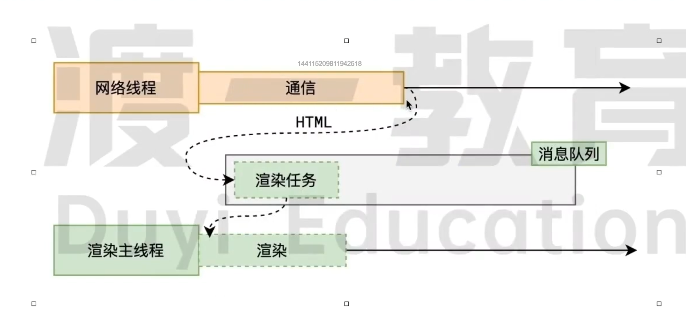

### 浏览器是如何渲染页面的？

当浏览器的网络线程收到 HTML 文档后，会产生一个渲染任务，并将其传递给渲染主线程的消息队列。

在事件循环机制的作用下，渲染主线程取出消息队列中的渲染任务，开启渲染流程。

#### 渲染流水线

整个渲染流程分为多个阶段，分别是: HTML 解析、样式计算、布局、分层、绘制、分块、光栅化、画每个阶段都有明确的输入输出，上一个阶段的输出会成为下一个阶段的输入。这样，整个渲染流程就形成了一套组织严密的生产流水线。

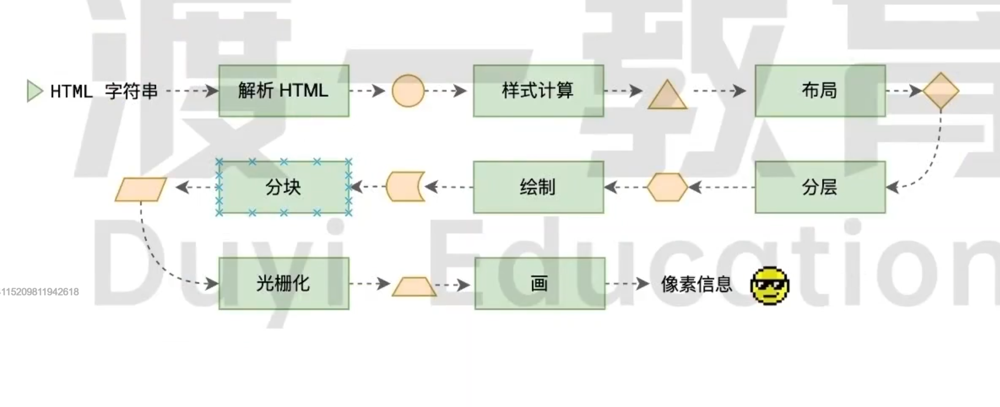

<br/>

##### 1. 解析HTML

因为字符串不好处理，所以需要将HTML字符串抽象为DOM（Document Object Model）树和CSSOM （CSS Object model）树（即抽象成对象）

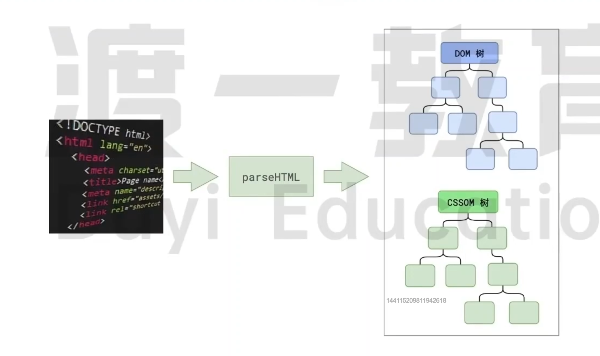

使用JS操作DOM时，就是在操作DOM树

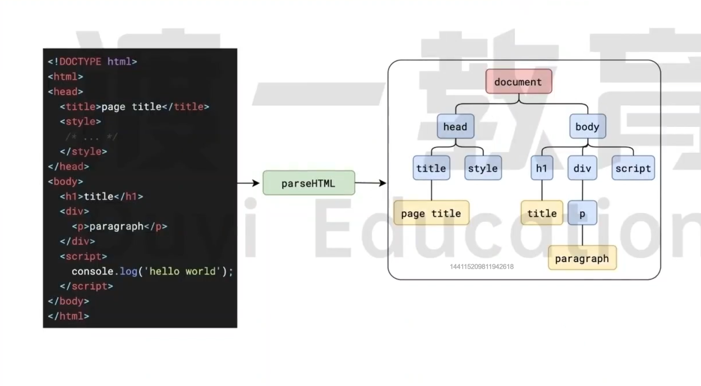

因为CSS规则与JS不一样所以树也不一样(JS也可以操作样式)

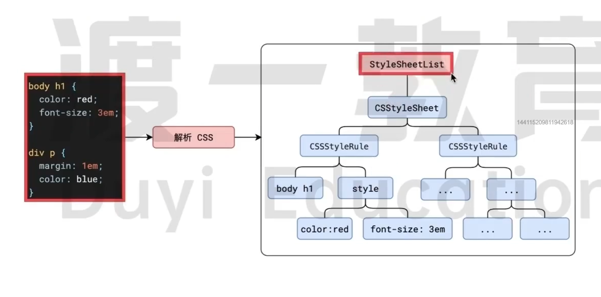


```js
           根节点代表页面中所有样式表（StylesheetList）
                             |
              每个规则形成一棵子树（CSSStyleRule）
         |                                         |
选择器为左子树（选择器名）                   具体规则为右子树（style）
```

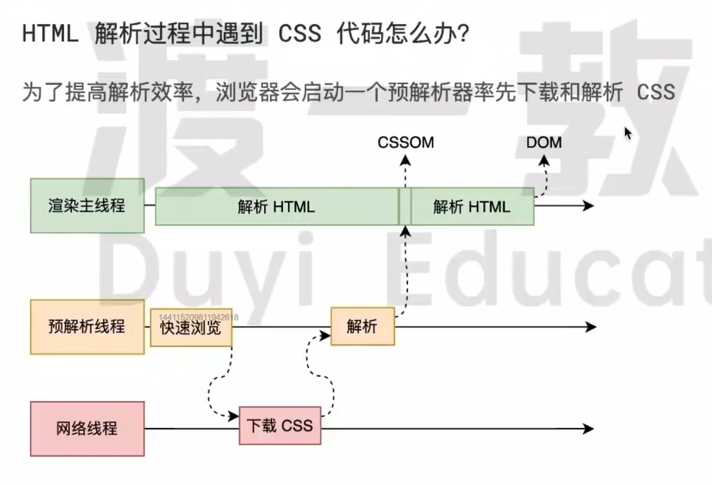

**CSS代码不会阻塞HTML的解析（因为跑在不同的线程）**

解析过程中遇到CSS解析CSS，遇到JS执行JS。为了提高解析效率，浏览器在开始解析前，会启动一个**预解析线程**，率先下载HTML中的外部CSS文件和外部的JS文件

如果主线程解析到```link```位置，此时外部的CSS文件还没有下载解析好，主线程不会等待，继续解析后续的HTML。这是因为下载和解析CSS的工作是在预解析线程中进行的。**这就是CSS不会阻塞HTML解析的根本原因。**


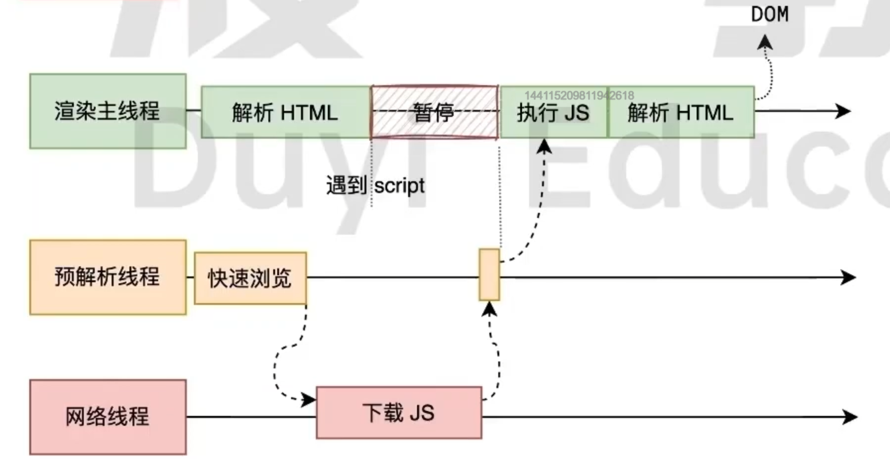

**渲染主线程遇到JS必须暂停一切行为，等待下载执行完后才能继续，预解析线程可以分担一点下载
JS的任务**

如果主线程解析到```script```位置，会停止解析HTML，转而等待JS文件下载好，并将全局代码解析执行完成后，才能继续解析HTML。这是因为JS代码的执行过程可能会修改当前DOM树，所以DOM树的生成必须暂停。**这就是JS会阻塞HTML解析的根本原因。**

**第一步完成后，会得到DOM树和CSSOM树**，浏览器的默认样式、内部样式、外部样式、行内样式均会包含在CSSOM树中。

***

##### 2. 样式计算
<br/>
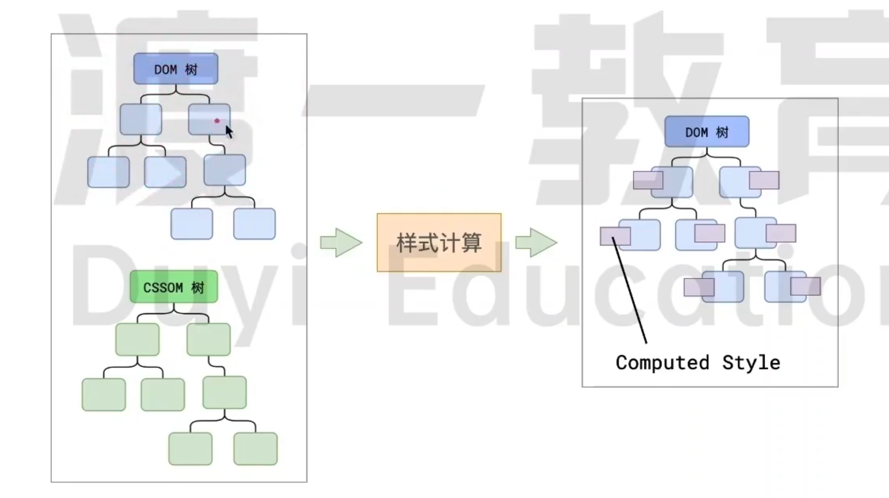

目的是得到每一个DOM节点的最终样式（计算后的样式-Computed Style：所有的CSS属性必须全部有值）<br/>
[可参考CSS属性值计算过程](../css/css属性值的计算过程)<br/>
[可参考CSS的层叠与继承](../css/css层叠与继承)

渲染的第二步是样式计算，依次为树中的每个节点计算出它最终的样式，称之为Computed Style

在这一过程中，很多预设值会变成绝对值，比如```red```会变成```rgb(255,0,0)```;相对单位会变成绝对单位，比如```em```会变成```px```

**这一步完成后，会得到一棵带有样式的DOM树**

***

##### 3. 布局
<br/>
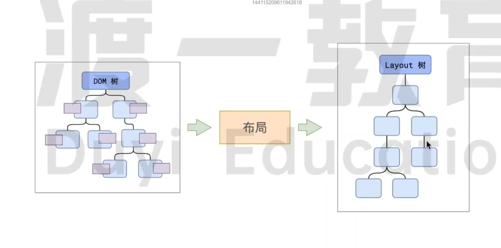

[可参考CSS视觉格式化模型](../css/css%E8%A7%86%E8%A7%89%E6%A0%BC%E5%BC%8F%E5%8C%96%E6%A8%A1%E5%9E%8B)

有些CSS属性（百分比、auto宽高、位置等）需要在布局属性算出

**DOM树与Layout(布局)树不一定是一一对应的**

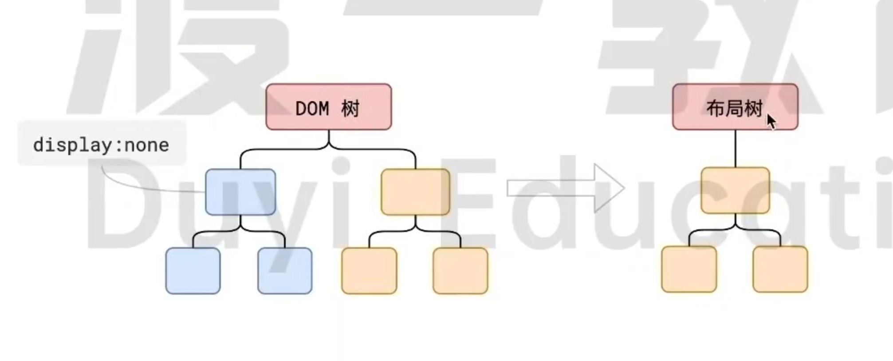

比如```display:none```的节点没有几何信息，因此不会生成到布局树；又比如使用了为元素选择器，虽然DOM树中不存在这些伪元素节点，但他们拥有几何信息，所以会生成到布局树中。还有匿名行盒、匿名块盒等都会导致DOM树和布局树无法一一对应

渲染的第三步是布局树，**布局完成后会得到布局树**

布局阶段会遍历每一个DOM树的节点，计算每个节点的几何信息（宽高、相对包含块的位置等）

##### 4. 分层
<br/>
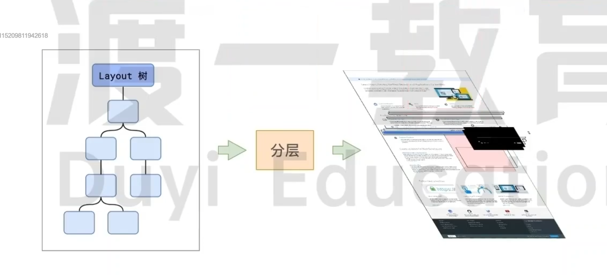

[堆叠上下文](../css/css视觉格式化模型.html#多个定位元素重叠)、z-index、opacity、transform等元素会影响分层结果

可以使用[will-change](https://developer.mozilla.org/zh-CN/docs/Web/CSS/will-change)属性来手动控制分层

渲染第四步是分层（每一层都会占用大量性能）

主线程会使用一套复杂的策略对整个布局树中进行分层

分层的好处在于，将来某一个层改变后，仅会对该层进行后续处理，从而提升效率。

滚动条、堆叠上下文、transform、opacity等样式都会或多或少的影响分层结果，也可通过```will-change```属性更大程度的影响分层结果

##### 5.绘制
<br/>
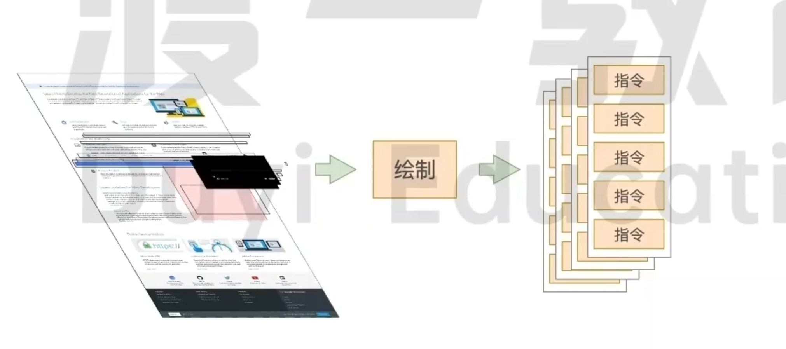

这里的绘制，是为每一层生成如何绘制的指令

例如：
```
将笔移动到10,30位置
画一个200*300的矩形
用红色填充矩形
将笔移动到500，600
```

**渲染主线程的工作到此为止，剩余步骤交给其他线程处理**

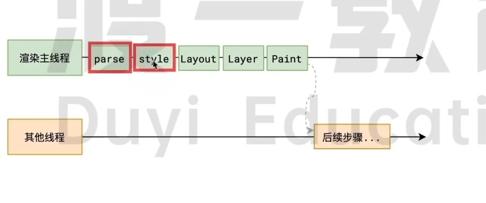

渲染第五步是绘制，主线程会为每个层单独产生绘制指令集，用于描述这一层的内容该如何画出来

##### 6.分块
<br/>
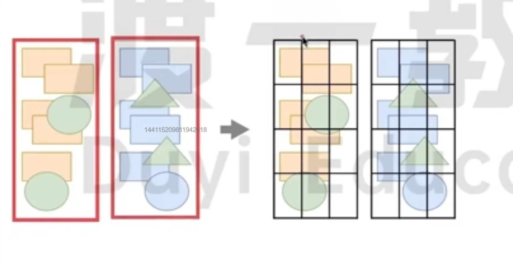

分块会将每一层分为多个小的区域

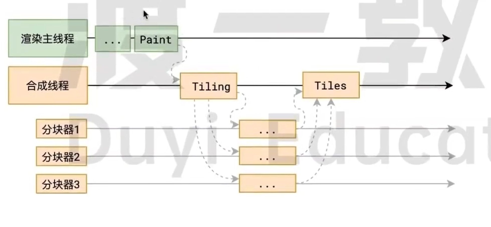

分块的工作是交给多个线程同时进行的

渲染的第六步是分块

完成第五步绘制后，主线程将每个图层的绘制信息提交给合成线程，剩余工作将有合成线程完成。

合成线程首先对每个图层进行分块，将其划分为更多的小区域

他会从线程池中拿取多个线程来完成分块工作。

##### 7.光栅化

光栅化是将每个块变成位图(类似二维数组，包含像素信息)

优先处理靠近视口的块
<br/>
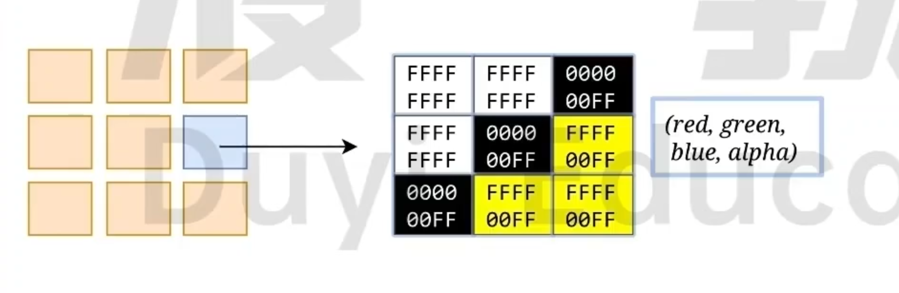

这个过程会用到GPU加速(显卡)
<br/>
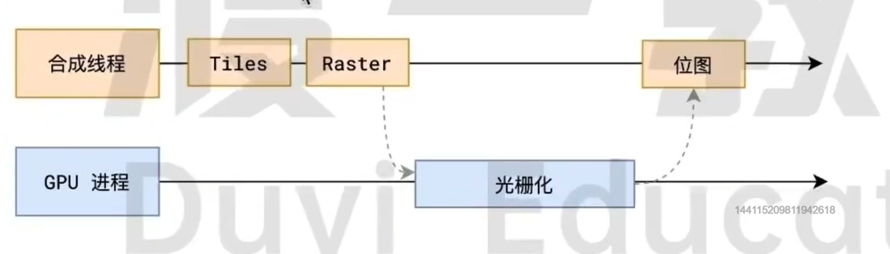


渲染第七步是光栅化

合成线程会将块信息交给GPU进程，以极高的速度完成光栅化。

GPU进程会开启多个线程来完成光栅化，并且优先处理靠近视口区域的块

**光栅化的结果，就是一块一块的位图**

##### 8. 画

合成线程计算处每个位图在屏幕上的位置，交给GPU进行最终呈现

<br/>
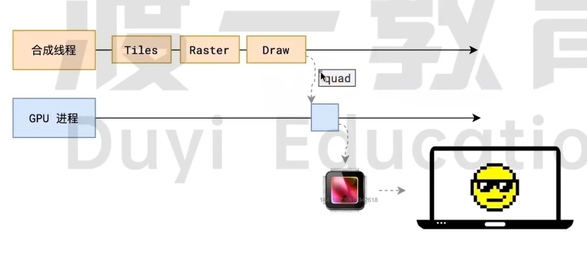

渲染第八步是画

合成线程拿到每个层、每个块的位图后，生成一个个[指引(quad)]信息。

指引会表示出每个位图应该画到屏幕的哪个位置，以及会考虑到旋转、缩放等变形。

变形发生在合成线程，与渲染主线程无关，这就是```transform```效率高的本质原因

合成线程会把quad提交给GPU进程，有GPU进程产生系统调用，提交给GPU硬件，完成最终的屏幕成像

##### 全过程

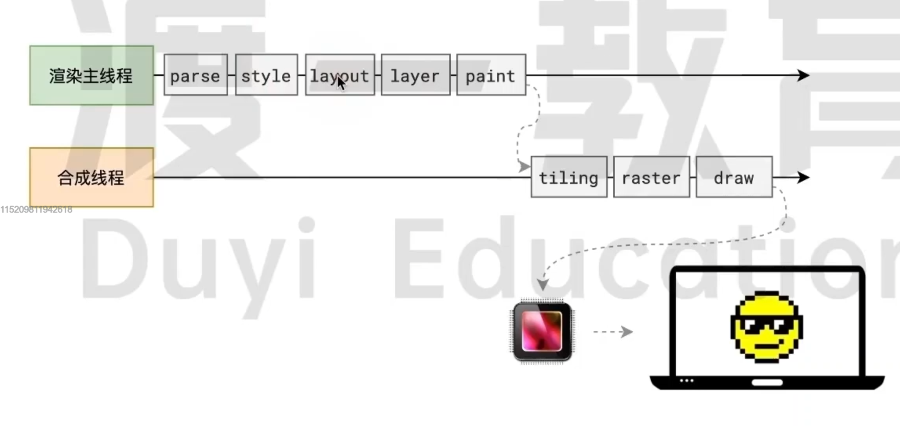


## 什么是reflow(重)?

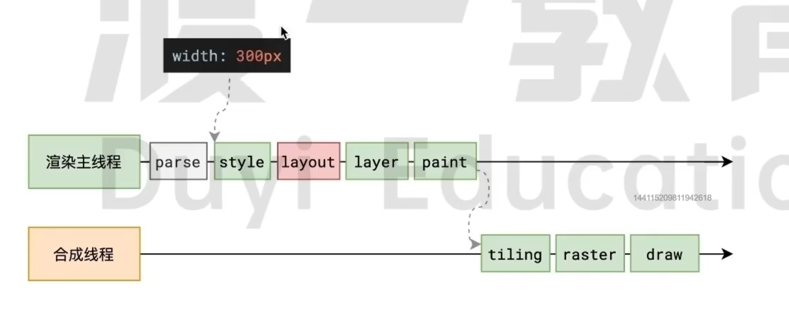

修改几何信息（尺寸、位置）等会影响布局的时候，会重新进行第二步样式计算


---

标准答案： reflow的本质就是重新计算layout树

当进行了影响布局树的操作后，需要重新计算布局树，会引发layout

为了避免连续的多次操作导致布局树反复计算，浏览器会合并这些操作，当JS代码全部完成后在进行统一计算。所以，改动属性造成的reflow是异步完成的

也同样因为如此，当JS获取布局属性时，就可能造成无法获取到最新的布局信息

浏览器在权衡下，最终决定获取属性立即reflow

## 什么是repaint
<br/>
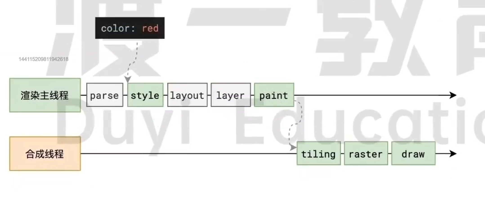

---

标准答案:repaint的本质就是重新更根据分层信息计算绘制指令

当改动了可见样式后，就需要重新计算，会引发repaint

由于元素的布局信息也属于可见样式，所以reflow一定会引起repaint

## 为什么transform效率高
<br/>
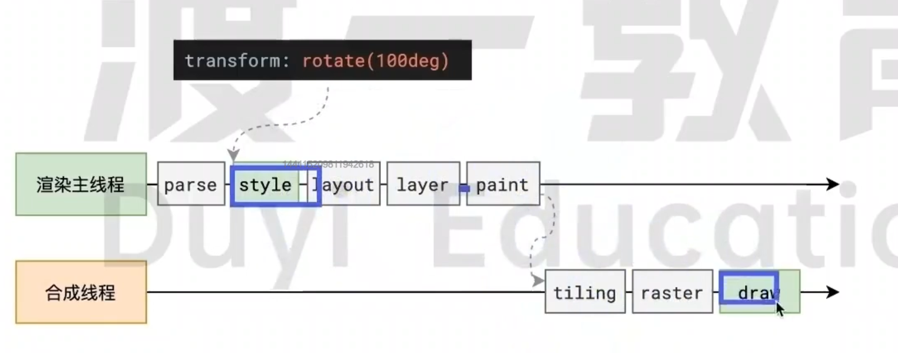
---

标准答案:因为transform既不会影响布局也不会影响绘制指令，他影响的只是渲染流程的最后一个[draw]阶段

由于draw阶段在合成线程中，所以transform的变化几乎不会影响渲染主线程。反之，渲染胸怀像昵称无论如何忙碌，也不会影响transform的变化。